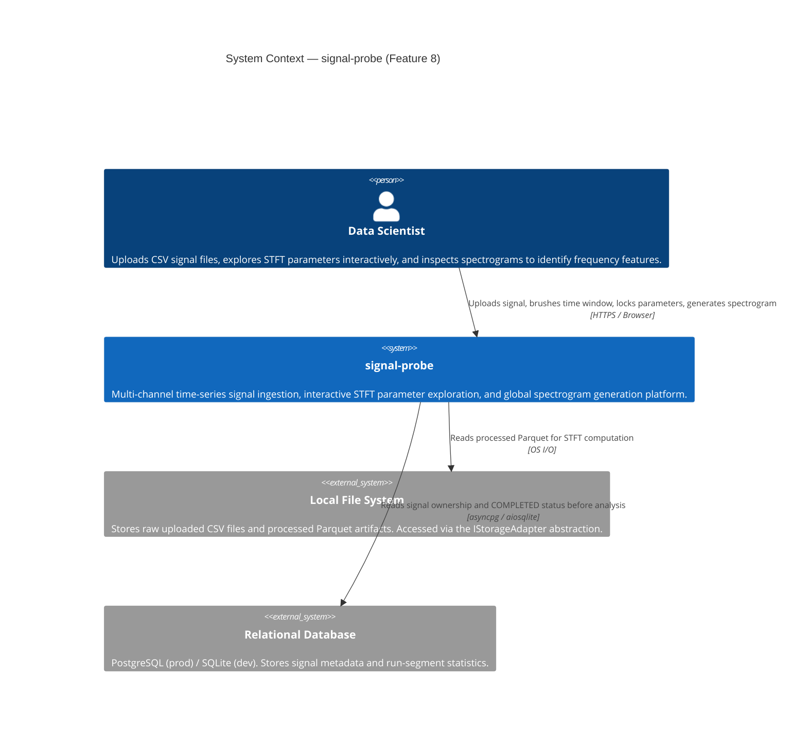
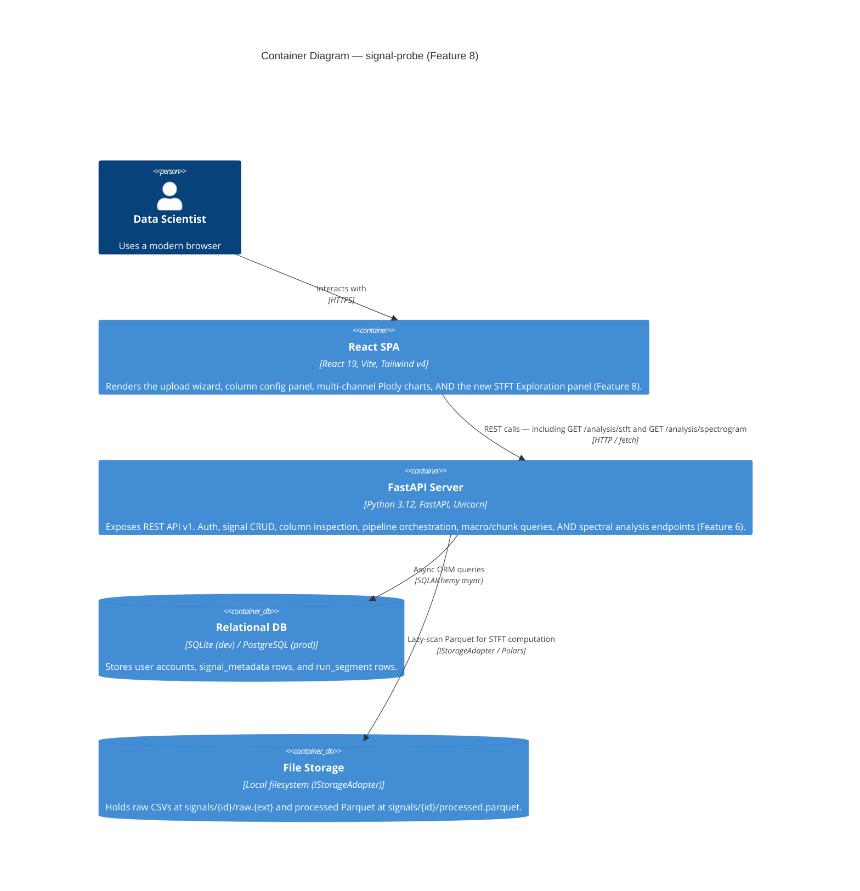
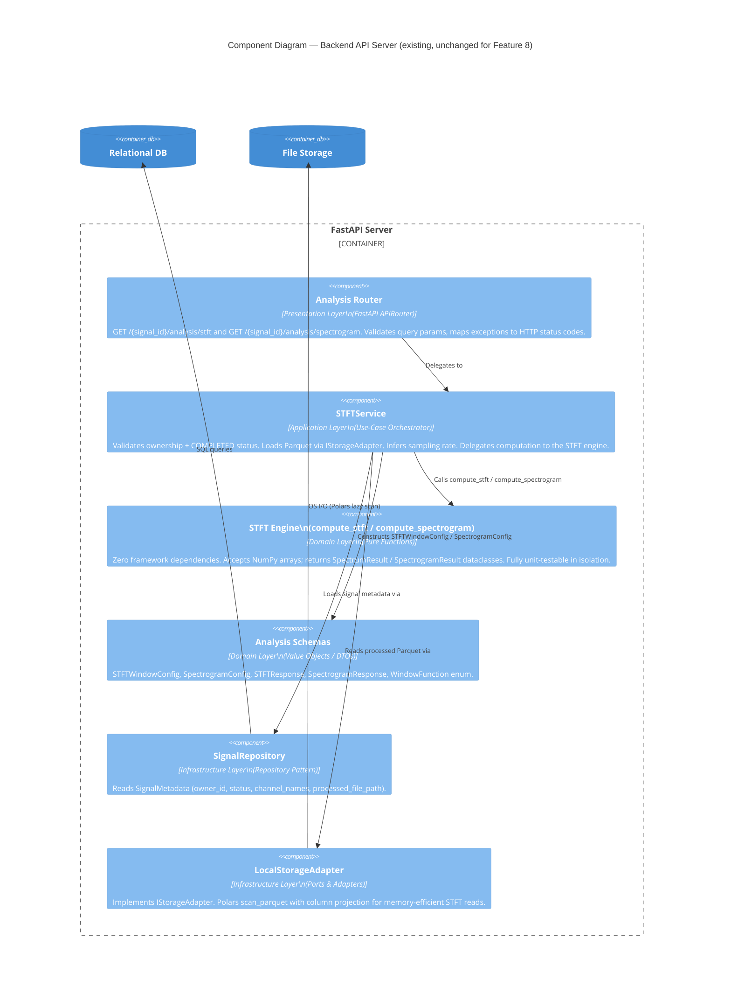
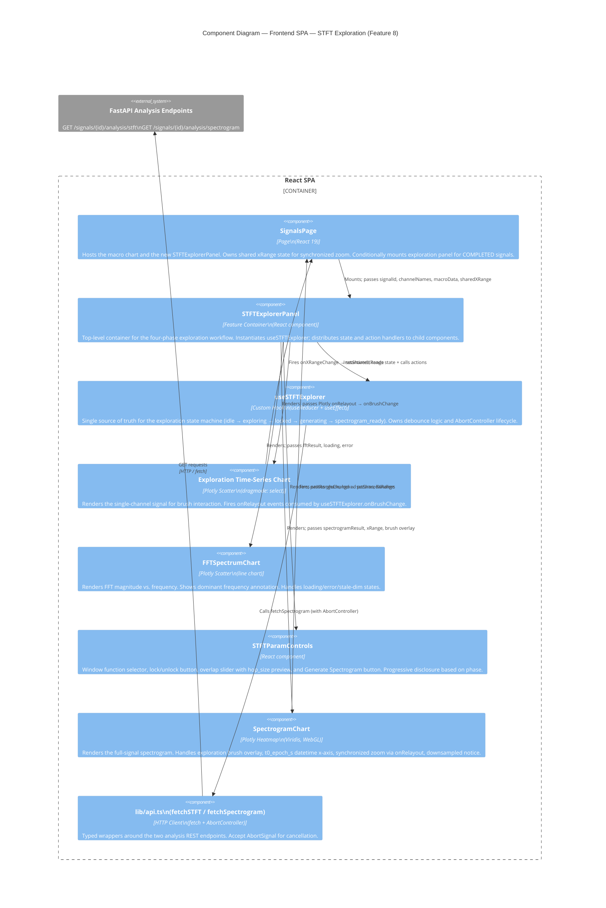
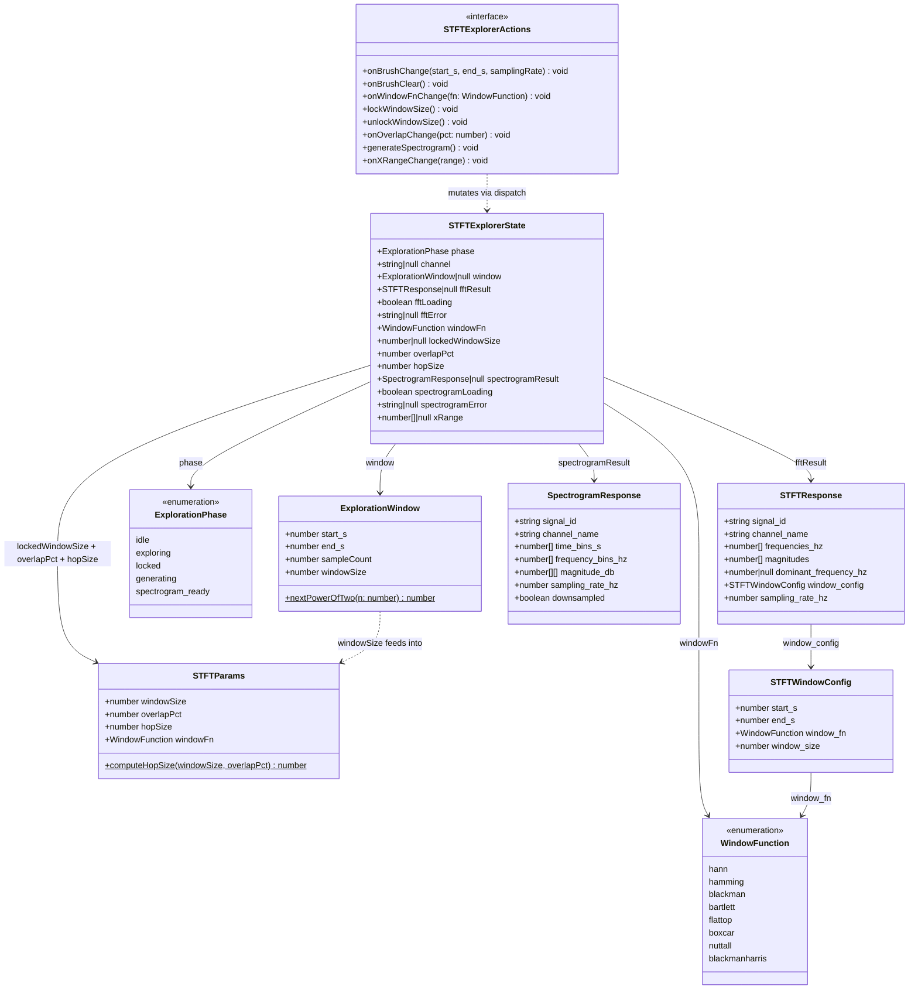
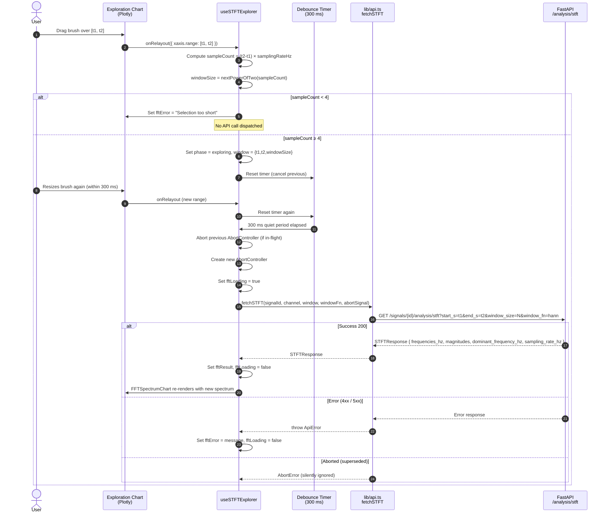
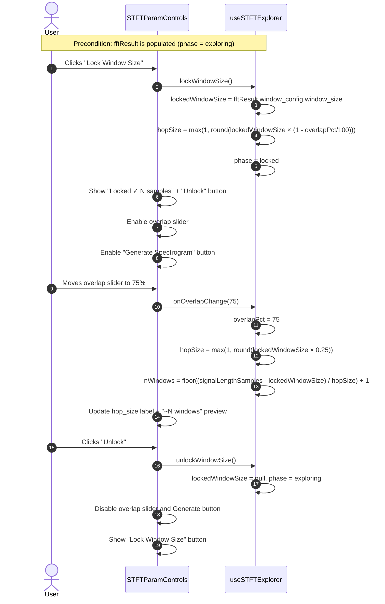
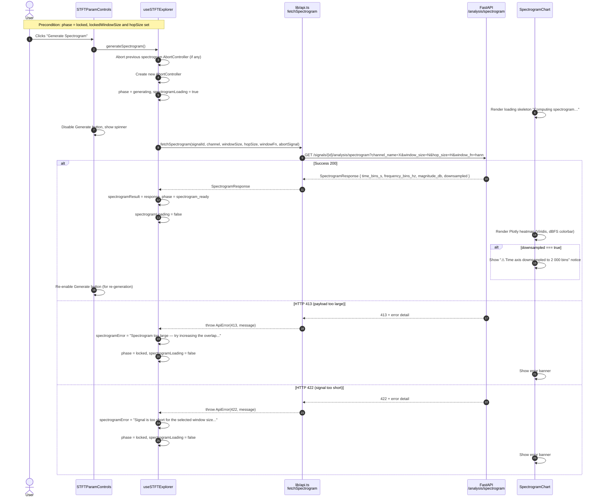
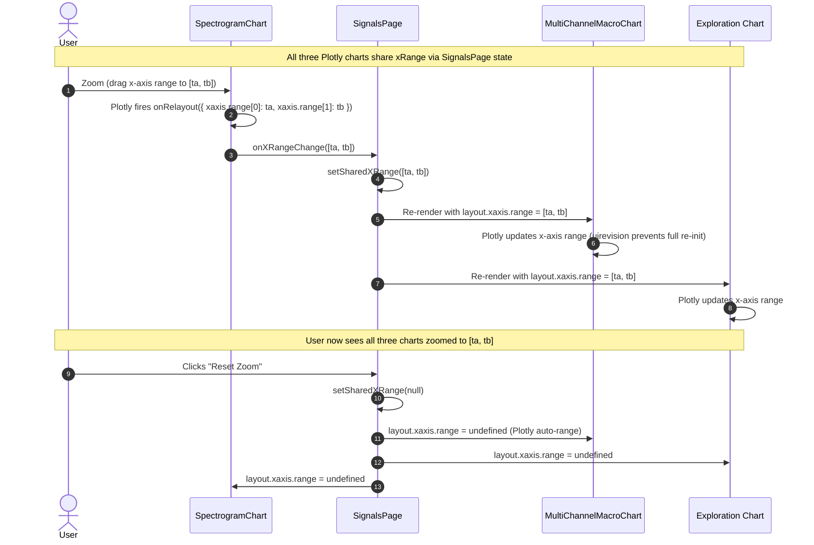

# Architecture Design Document

**Service:** signal-probe
**Feature:** Interactive STFT Parameter Exploration & Spectrogram Generation
**Architect:** GitHub Copilot (Architecture-Design Skill)
**Version:** 1.0
**Date:** 2026-04-25
**Status:** Draft — For Review

> **Related Documents**
> - Business Requirements: `SRS.md`
> - Technical Specification: `SDD.md`
> - Architecture Decision Records: See §8 of this document.

---

## Table of Contents

1. [Service Identity](#1-service-identity)
2. [C4 Diagrams](#2-c4-diagrams)
   - [2.1 Context Diagram (System Level)](#21-context-diagram-system-level)
   - [2.2 Container Diagram](#22-container-diagram)
   - [2.3 Component Diagram — Backend API Server](#23-component-diagram--backend-api-server)
   - [2.4 Component Diagram — Frontend SPA (Feature 8)](#24-component-diagram--frontend-spa-feature-8)
3. [Domain Model: UML Class Diagram](#3-domain-model-uml-class-diagram)
4. [Interaction Design: UML Sequence Diagrams](#4-interaction-design-uml-sequence-diagrams)
   - [4.1 Brush Exploration → Live FFT Flow](#41-brush-exploration--live-fft-flow)
   - [4.2 Window Lock & Overlap Configuration Flow](#42-window-lock--overlap-configuration-flow)
   - [4.3 Spectrogram Generation & Render Flow](#43-spectrogram-generation--render-flow)
   - [4.4 Synchronized X-Axis Zoom Flow](#44-synchronized-x-axis-zoom-flow)
5. [REST API Contracts](#5-rest-api-contracts)
6. [LLD: Clean Architecture Compliance](#6-lld-clean-architecture-compliance)
7. [SOLID Principles Analysis](#7-solid-principles-analysis)
8. [Architecture Decision Records (ADRs)](#8-architecture-decision-records-adrs)
9. [Assumptions & External Dependencies](#9-assumptions--external-dependencies)

---

## 1. Service Identity

| Property | Value |
|---|---|
| **Service Name** | signal-probe |
| **Owner Team** | Platform / Signal Analysis |
| **API Version** | `v1` |
| **Base URL** | `http://localhost:8000/api/v1` (dev) |
| **Auth Mechanism** | Bearer JWT (issued by `/api/v1/auth/login`) |
| **Primary Persistence** | SQLite (dev) / PostgreSQL (prod) via SQLAlchemy async |
| **Secondary Persistence** | Local filesystem Parquet files via `IStorageAdapter` |
| **Frontend** | React 19 SPA (Vite + Tailwind v4), served on port 5173 |
| **Feature Scope** | Entirely frontend — backend analysis endpoints unchanged from Feature 6 |

---

## 2. C4 Diagrams

### 2.1 Context Diagram (System Level)

The Context diagram places signal-probe as a whole in its environment. Feature 8 adds no new external systems; it surfaces the existing spectral analysis capability through a richer interactive UI.



---

### 2.2 Container Diagram

Feature 8 adds no new containers. It extends the React SPA with new components that consume two existing FastAPI analysis endpoints.



---

### 2.3 Component Diagram — Backend API Server

The backend is **unchanged** by Feature 8. This diagram shows the existing analysis components for completeness and to confirm their interfaces are sufficient.



---

### 2.4 Component Diagram — Frontend SPA (Feature 8)

This diagram shows the new exploration components and their relationships within the React SPA.



---

## 3. Domain Model: UML Class Diagram

This diagram captures the key types for Feature 8: the frontend value objects, the hook state machine, the component hierarchy, and the API response types consumed from the backend.



---

## 4. Interaction Design: UML Sequence Diagrams

### 4.1 Brush Exploration → Live FFT Flow

This sequence covers the debounced FFT request lifecycle from brush drag to spectrum render, including the AbortController cancellation guard.



---

### 4.2 Window Lock & Overlap Configuration Flow

This is a purely local state transition; no API calls are made.



---

### 4.3 Spectrogram Generation & Render Flow



---

### 4.4 Synchronized X-Axis Zoom Flow



---

## 5. REST API Contracts

Both endpoints were introduced in Feature 6. Feature 8 consumes them without modification.

### 5.1 GET /signals/{signal_id}/analysis/stft

- **Purpose:** Compute the one-sided FFT magnitude spectrum for a user-defined time window.
- **Authentication:** Bearer JWT (required)
- **Path Parameter:** `signal_id` — UUID of the target signal.

**Query Parameters:**

| Parameter | Type | Required | Default | Constraint |
|---|---|---|---|---|
| `channel_name` | string | ✓ | — | Must exist in `signal_metadata.channel_names` |
| `start_s` | float | ✓ | — | ≥ 0 |
| `end_s` | float | ✓ | — | > `start_s` |
| `window_fn` | enum | — | `hann` | See `WindowFunction` enum |
| `window_size` | int | — | `1024` | Power of 2; range [4, 131 072] |

**Success Response `200 OK`:**
```json
{
  "signal_id": "3fa85f64-5717-4562-b3fc-2c963f66afa6",
  "channel_name": "sensor_a",
  "frequencies_hz": [0.0, 0.976, 1.953],
  "magnitudes": [0.002, 0.845, 0.234],
  "dominant_frequency_hz": 12.207,
  "window_config": {
    "start_s": 1.0,
    "end_s": 2.024,
    "window_fn": "hann",
    "window_size": 1024
  },
  "sampling_rate_hz": 1000.0
}
```

**Error Responses:**

| Status | Condition |
|---|---|
| `401` | Missing or invalid JWT |
| `404` | Signal or channel not found |
| `409` | Signal status is not `COMPLETED` |
| `422` | Invalid query params (window_size not power-of-2; start_s ≥ end_s; signal segment too short) |

---

### 5.2 GET /signals/{signal_id}/analysis/spectrogram

- **Purpose:** Compute the full-signal sliding-window STFT spectrogram in dBFS.
- **Authentication:** Bearer JWT (required)
- **Path Parameter:** `signal_id` — UUID of the target signal.

**Query Parameters:**

| Parameter | Type | Required | Default | Constraint |
|---|---|---|---|---|
| `channel_name` | string | ✓ | — | Must exist in `signal_metadata.channel_names` |
| `window_fn` | enum | — | `hann` | See `WindowFunction` enum |
| `window_size` | int | — | `1024` | Power of 2; range [4, 131 072] |
| `hop_size` | int | — | `512` | ≥ 1; must be ≤ `window_size` |

**Success Response `200 OK`:**
```json
{
  "signal_id": "3fa85f64-5717-4562-b3fc-2c963f66afa6",
  "channel_name": "sensor_a",
  "time_bins_s": [0.512, 1.024, 1.536],
  "frequency_bins_hz": [0.0, 0.976, 1.953],
  "magnitude_db": [[-80.2, -72.1, -65.3], [-78.4, -71.0, -66.8]],
  "sampling_rate_hz": 1000.0,
  "downsampled": false
}
```

**Error Responses:**

| Status | Condition |
|---|---|
| `401` | Missing or invalid JWT |
| `404` | Signal or channel not found |
| `409` | Signal status is not `COMPLETED` |
| `413` | Spectrogram matrix exceeds `STFT_MAX_RESPONSE_MB` limit |
| `422` | Invalid params or signal shorter than `window_size` |

---

## 6. LLD: Clean Architecture Compliance

Feature 8 adds exclusively frontend components. The analysis below verifies that the new frontend code respects Clean Architecture boundaries, and confirms the backend is untouched.

### 6.1 Backend (unchanged)

The existing backend already conforms to Clean Architecture as established in Feature 6:

| Layer | Module | Dependency Rule Compliance |
|---|---|---|
| Domain | `stft_engine.py`, `domain/analysis/schemas.py` | Zero framework imports ✓ |
| Application | `stft_service.py` | Depends only on domain abstractions + `IStorageAdapter` interface ✓ |
| Infrastructure | `LocalStorageAdapter`, `SignalRepository` | Implements domain interfaces; no domain layer imports ✓ |
| Presentation | `endpoints/analysis.py` | Translates HTTP ↔ Use Case; catches typed exceptions and maps to HTTP codes ✓ |

### 6.2 Frontend (new — Feature 8)

Although the frontend does not use the same strict layering as a backend server, the same dependency-inversion and separation-of-concerns principles are applied:

| Concern | Location | Clean Architecture Analogue |
|---|---|---|
| **Business rules** (power-of-2 window, hop_size formula, phase transitions) | `useSTFTExplorer.ts` | Domain / Application layer — zero UI framework imports in the pure logic functions |
| **Use-case orchestration** (debounce, AbortController, error mapping) | `useSTFTExplorer.ts` | Application layer — orchestrates async side-effects, delegates HTTP calls to `api.ts` |
| **I/O adapter** (HTTP fetch, error deserialization) | `lib/api.ts` | Infrastructure layer — all `fetch()` calls isolated here; easy to mock in tests |
| **Presentation** (layout, Plotly config, accessibility) | `STFTExplorerPanel.tsx`, `FFTSpectrumChart.tsx`, `SpectrogramChart.tsx`, `STFTParamControls.tsx` | Presentation layer — purely renders state; no business logic |

**Dependency direction is enforced:**
- Presentation components receive state and actions via props; they do **not** import `lib/api.ts` directly.
- `useSTFTExplorer` imports `lib/api.ts` but does **not** import Plotly or any React UI component.
- `lib/api.ts` imports nothing from the hook or components layer.

### 6.3 Error Handling Boundary

Following the LLD error-handling standard, errors are raised and propagated upward, then mapped at the boundary:

```
lib/api.ts            → throws ApiError(status, message)
useSTFTExplorer       → catches ApiError; maps to { fftError | spectrogramError } state string
                       (AbortError is silently discarded — not a real failure)
FFTSpectrumChart      → renders error banner from props.error
SpectrogramChart      → renders error banner from props.error
```

No raw error messages or stack traces reach the user. Error strings are user-safe and actionable (e.g., "Spectrogram too large — try increasing the overlap").

---

## 7. SOLID Principles Analysis

### S — Single Responsibility Principle

| Component | Single Responsibility |
|---|---|
| `useSTFTExplorer` | Owns the exploration state machine, debounce, and async side-effects — nothing else |
| `FFTSpectrumChart` | Renders the FFT spectrum; knows nothing about how the data was fetched |
| `SpectrogramChart` | Renders the spectrogram heatmap and synchronized zoom; no STFT business logic |
| `STFTParamControls` | Renders and dispatches parameter UI interactions; no computation |
| `lib/api.ts` (`fetchSTFT`, `fetchSpectrogram`) | HTTP transport only; no state or UI concerns |

### O — Open/Closed Principle

- `STFTExplorerPanel` is closed to modification but open for extension: adding a new visualization panel (e.g., a phase-spectrum view) requires only a new child component and a new hook state field — no changes to existing components.
- `WindowFunction` is a TypeScript string union mirroring the backend `StrEnum`. Adding a new window function requires only adding it to both enums — no switch statements to modify.

### L — Liskov Substitution Principle

- `fetchSTFT` and `fetchSpectrogram` both return `Promise<T>` and accept an optional `AbortSignal`. Any future mock implementation used in tests is fully substitutable — the hook is unaware whether it is talking to a real server or a stub.

### I — Interface Segregation Principle

- `STFTParamControlsProps` does not expose hook internals (e.g., the raw `AbortController` or the dispatch function). It receives only the minimal set of values and callbacks it actually renders, preventing tight coupling to the hook's internal implementation.
- `SpectrogramChartProps` does not include FFT-specific data; it only receives `SpectrogramResponse` and zoom state. This prevents the spectrogram component from depending on the exploration phase.

### D — Dependency Inversion Principle

- `useSTFTExplorer` depends on the `fetchSTFT` / `fetchSpectrogram` function signatures (abstractions), not on `fetch()` directly. In tests, these functions can be replaced with mocks passed as parameters (or mocked via Jest/MSW) without modifying the hook.
- `STFTExplorerPanel` depends on the `useSTFTExplorer` return type (an interface), not on its internal implementation. The hook could be replaced with a different implementation (e.g., one that caches results) without changing any component.

---

## 8. Architecture Decision Records (ADRs)

### ADR-1: Feature 8 is Frontend-Only — No Backend Changes

| Field | Detail |
|---|---|
| **Status** | Accepted |
| **Context** | Feature 8 requires live FFT preview and full spectrogram generation. Both computations were already implemented in Feature 6 via `GET /signals/{id}/analysis/stft` and `GET /signals/{id}/analysis/spectrogram`. |
| **Decision** | Implement Feature 8 exclusively in the React SPA. The two existing analysis endpoints are consumed as-is without modification. |
| **Rationale** | Avoids deployment coupling between frontend and backend. Reduces blast radius — a frontend-only PR cannot break the backend pipeline or database migrations. |
| **Consequences** | Frontend must handle all UX state (phase machine, debounce, abort). Backend endpoints must remain backward-compatible if their signatures change in future features. |
| **Rejected Alternative** | A dedicated "exploration session" backend endpoint that caches partial STFT results for faster re-queries — rejected as premature optimization given the current single-user scope. |

---

### ADR-2: Debounce (300 ms) Over Throttle for Brush Interactions

| Field | Detail |
|---|---|
| **Status** | Accepted |
| **Context** | The brush can fire dozens of `onRelayout` events per second during a drag. Naively calling the FFT API on every event would cause hundreds of redundant in-flight requests. |
| **Decision** | Apply a **debounce** of 300 ms: the API call fires only after the user stops dragging for 300 ms. Each new drag event resets the timer. |
| **Rationale** | Debounce fires *after* user intent is resolved (brush drag complete), producing a single meaningful API call per gesture. Throttle would fire at a fixed rate *during* dragging, often with intermediate, irrelevant window positions — wasting compute and producing a jarring spectrum update mid-gesture. |
| **Consequences** | There is a 300 ms perceived lag between stopping the drag and seeing the spectrum update. This is acceptable per the SRS NFR: "maintaining a fluid user experience with acceptable latency." |
| **Rejected Alternative** | Throttle at 500 ms — fires too frequently during fast drags and doesn't guarantee firing after the gesture is complete. |

---

### ADR-3: AbortController for In-Flight Request Cancellation

| Field | Detail |
|---|---|
| **Status** | Accepted |
| **Context** | A new brush event can arrive before the previous FFT response returns. Without cancellation, stale responses can overwrite newer spectrum renders (race condition). |
| **Decision** | Maintain one `AbortController` per request type (FFT, spectrogram). Before dispatching a new request, call `abort()` on the previous controller. Ignore `AbortError` in the catch block. |
| **Rationale** | The Web Fetch API's `AbortController` is the standard, zero-dependency mechanism for request cancellation in modern browsers. It cancels the underlying TCP connection, saving backend resources. |
| **Consequences** | Backend may occasionally receive a request that is cancelled mid-flight; FastAPI handles this via `asyncio.CancelledError` without side effects (analysis endpoints are read-only). |
| **Rejected Alternative** | Request-ID version counter (ignore responses whose request_id < current_id) — works but doesn't cancel the in-flight network request, wasting bandwidth. |

---

### ADR-4: `useReducer` State Machine Over Multiple `useState` Calls

| Field | Detail |
|---|---|
| **Status** | Accepted |
| **Context** | The exploration workflow has 5 phases with strict transition rules. Implementing this with multiple independent `useState` calls risks partial state updates (e.g., `fftLoading = true` without `phase = exploring`) causing inconsistent renders. |
| **Decision** | Use React `useReducer` with a typed `Action` union. Each action type produces an atomic state transition. The `phase` field is the single source of truth for workflow position. |
| **Rationale** | `useReducer` guarantees atomic state transitions — the reducer runs synchronously and returns the next complete state. This eliminates the class of "partially updated state" bugs that arise with multiple `useState` calls during async operations. The typed action union also makes the valid transition table self-documenting. |
| **Consequences** | Slightly more boilerplate than `useState`. Requires a well-defined `ExplorationAction` union type. Worth the investment given the 5-phase state machine complexity. |
| **Rejected Alternative** | Zustand global store — unnecessary for component-local exploration state; introduces a new dependency. |

---

### ADR-5: Viridis Colorscale for Spectrogram

| Field | Detail |
|---|---|
| **Status** | Accepted |
| **Context** | A colorscale must be chosen for the spectrogram heatmap. Common choices are Jet, Hot, Inferno, Viridis. |
| **Decision** | **Viridis** is mandatory. `Jet` is explicitly forbidden. |
| **Rationale** | Viridis is perceptually uniform (equal perceived distance per dBFS unit), colorblind-safe (deuteranopia/protanopia friendly), and reproduces correctly in grayscale printing. `Jet` has severe perceptual non-uniformity — its rainbow bands create false visual features (phantom peaks) in the spectrogram that mislead analysts. This is a direct violation of the project's scientific visualization policy. |
| **Consequences** | All SpectrogramChart renders must hardcode `colorscale: 'Viridis'`. A future user preference for colorscale is deferred. |
| **Rejected Alternative** | Inferno — perceptually uniform and accessible, but lacks the intuitive low→high energy mapping (dark→light) that Viridis provides. Deferred as a future user preference. |

---

### ADR-6: window_size = Next Power of 2 ≥ Brush Sample Count

| Field | Detail |
|---|---|
| **Status** | Accepted |
| **Context** | The FFT algorithm (`numpy.fft.rfft`) is most efficient on power-of-2 input lengths. The brush gives an arbitrary sample count; the backend's `window_size` parameter must be a power of 2. |
| **Decision** | The frontend computes `windowSize = nextPowerOfTwo(sampleCount)`, capped at 131 072. This derived value is displayed to the user and sent to the backend. |
| **Rationale** | Zero-padding to the next power of 2 is standard practice in DSP. It avoids forcing users to manually calculate powers of 2 from their brush selection, reducing cognitive load. The derived window_size is always ≥ the actual segment length, so the full segment is always included (the excess is zero-padded by the backend engine). |
| **Consequences** | The effective frequency resolution is `sampling_rate_hz / windowSize` (based on the padded size), which may be slightly finer than the "natural" resolution of the brush selection. This is explained in the FFT panel header. |
| **Rejected Alternative** | Truncate to the largest power of 2 ≤ sampleCount — discards data at the end of the brush region; worse for users who need to capture a specific endpoint. |

---

## 9. Assumptions & External Dependencies

| # | Type | Description | Risk | Fallback Strategy |
|---|---|---|---|---|
| 1 | Assumption | The signal has `COMPLETED` status and a valid processed Parquet file before the exploration view is accessible. | — | The `STFTExplorerPanel` checks signal status and renders a disabled placeholder for non-COMPLETED signals. |
| 2 | Assumption | The processed Parquet `timestamp_s` column is monotonically increasing with near-uniform spacing, enabling reliable `sampling_rate_hz` inference via median inter-sample interval. | — | The backend `_infer_sampling_rate` raises `ValueError` for non-positive median dt; the endpoint returns 422 with an actionable message. |
| 3 | Assumption | The frontend always receives a valid `sampling_rate_hz` from `STFTResponse` before the user locks the window size. This is needed to compute `n_windows` preview. | Low | If no FFT has been fetched yet, the `n_windows` preview is hidden ("Lock a window first"). |
| 4 | Ext. Dependency | **Plotly.js** — brush selection (`dragmode: 'select'`), heatmap trace type, `onRelayout` event, WebGL acceleration. | Medium | Plotly.js is already bundled (`plotly-dist-min`). Heatmap and Scatter trace types are included. No new bundle import required. If Plotly's WebGL path fails (older browser), canvas fallback is automatic. |
| 5 | Ext. Dependency | **FastAPI analysis endpoints** — `GET /analysis/stft` and `GET /analysis/spectrogram` — must remain available and backward-compatible. | Low | Endpoints are read-only and already stable since Feature 6. If they become unavailable, all error states are handled gracefully in the hook with actionable error messages. |
| 6 | Ext. Dependency | **STFT_MAX_RESPONSE_MB** environment variable — caps spectrogram payload size. Default: 50 MB. | Medium | HTTP 413 is handled with a user-friendly error message instructing the user to increase overlap or reduce window size. No crash or unhandled state. |
| 7 | Assumption | The browser supports the `AbortController` API (all modern browsers, available since Chrome 66, Firefox 57, Safari 11.1). | Low | Signal-probe targets modern browsers; no polyfill required. |
