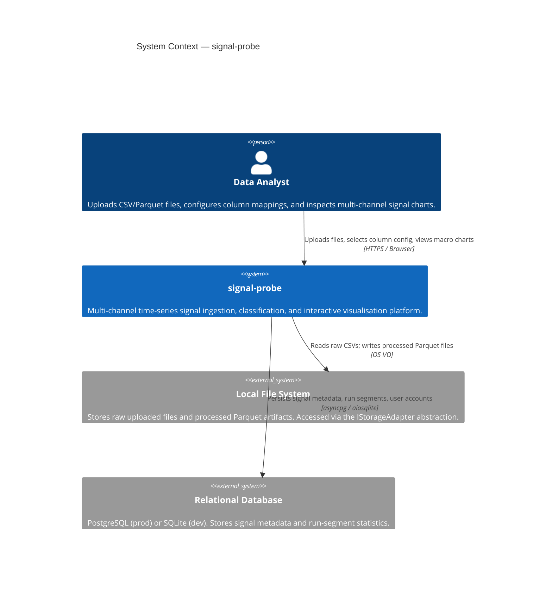
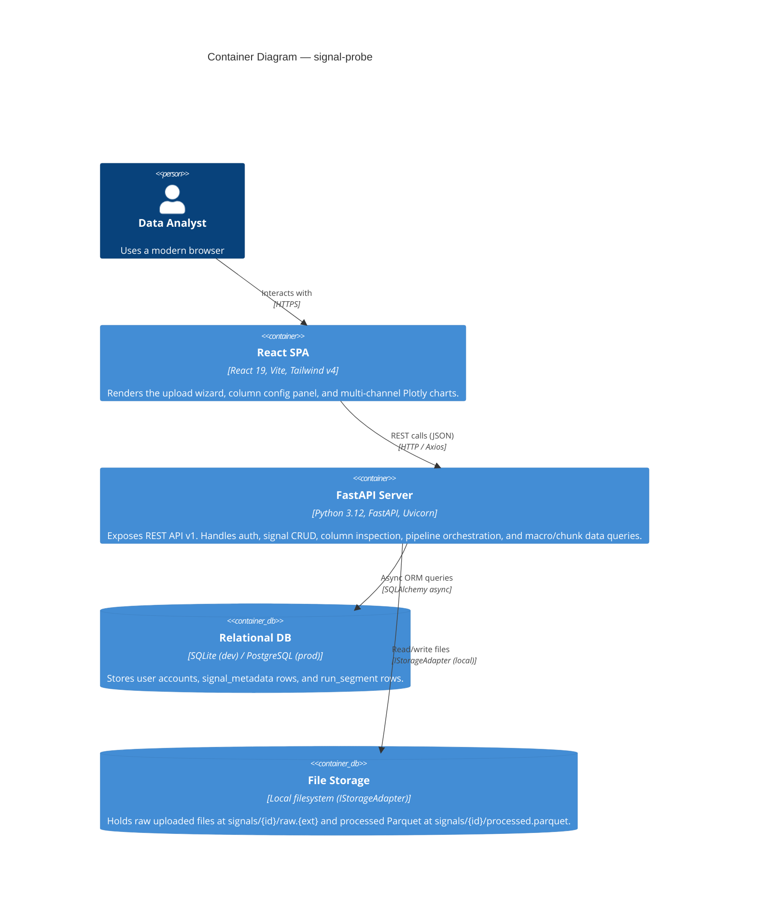
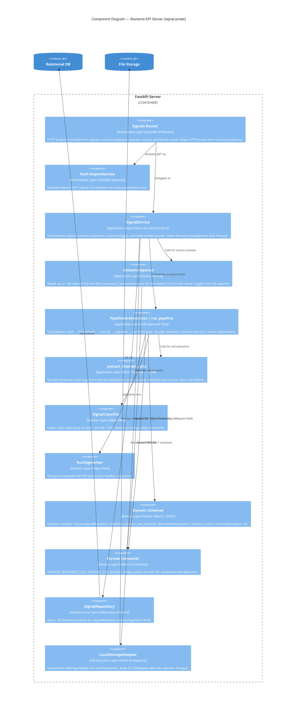
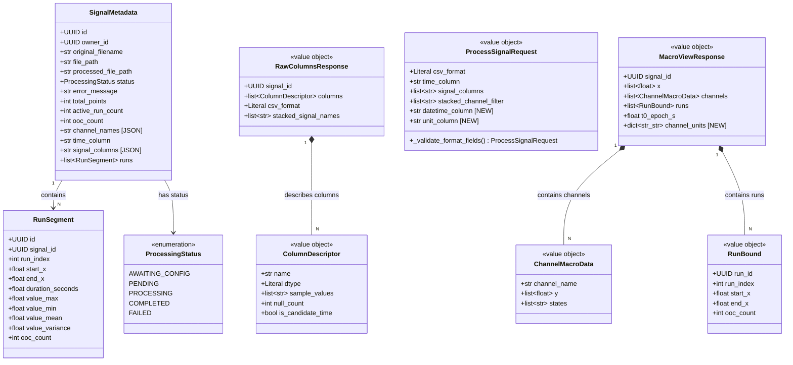
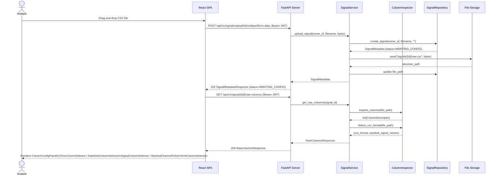
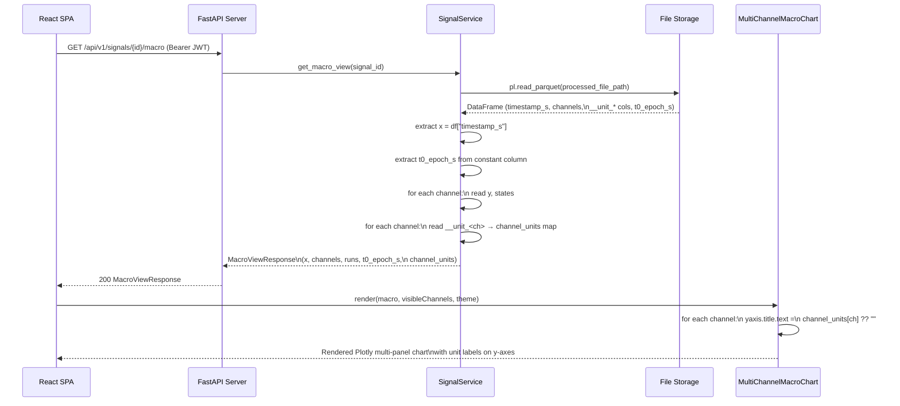

# Architecture Design Document

**Service:** signal-probe
**Feature:** User-Configurable X-Axis Datetime Column & Signal Unit Mapping
**Architect:** GitHub Copilot (Architecture-Design Skill)
**Version:** 1.0
**Date:** 2026-04-23
**Status:** Draft — For Review

> **Related Documents**
> - Business Requirements: `SRS.md`
> - Technical Specification: `SDD.md`
> - Architecture Decision Records: See §8 of this document.

---

## Table of Contents

1. [Service Identity](#1-service-identity)
2. [C4 Diagrams](#2-c4-diagrams)
   - [2.1 Context Diagram (System Level)](#21-context-diagram-system-level)
   - [2.2 Container Diagram](#22-container-diagram)
   - [2.3 Component Diagram — Backend API Server](#23-component-diagram--backend-api-server)
3. [Domain Model: UML Class Diagram](#3-domain-model-uml-class-diagram)
4. [Interaction Design: UML Sequence Diagrams](#4-interaction-design-uml-sequence-diagrams)
   - [4.1 Upload & Column Inspection Flow](#41-upload--column-inspection-flow)
   - [4.2 Column Configuration & Pipeline Trigger Flow](#42-column-configuration--pipeline-trigger-flow)
   - [4.3 Macro View Retrieval Flow](#43-macro-view-retrieval-flow)
5. [REST API Contracts](#5-rest-api-contracts)
6. [LLD: Clean Architecture Compliance](#6-lld-clean-architecture-compliance)
7. [SOLID Principles Analysis](#7-solid-principles-analysis)
8. [Architecture Decision Records (ADRs)](#8-architecture-decision-records-adrs)
9. [Assumptions & External Dependencies](#9-assumptions--external-dependencies)

---

## 1. Service Identity

| Property | Value |
|---|---|
| **Service Name** | signal-probe |
| **Owner Team** | Platform / Signal Analysis |
| **API Version** | `v1` |
| **Base URL** | `http://localhost:8000/api/v1` (dev) |
| **Auth Mechanism** | Bearer JWT (issued by `/api/v1/auth/login`) |
| **Primary Persistence** | SQLite (dev) / PostgreSQL (prod) via SQLAlchemy async |
| **Secondary Persistence** | Local filesystem Parquet files via `IStorageAdapter` |
| **Frontend** | React 19 SPA (Vite + Tailwind v4), served separately on port 5173 |

---

## 2. C4 Diagrams

### 2.1 Context Diagram (System Level)

The Context diagram shows signal-probe as a whole, the actors who use it, and the external systems it depends on.



---

### 2.2 Container Diagram

The Container diagram decomposes signal-probe into its runtime containers and their communication channels.



---

### 2.3 Component Diagram — Backend API Server

This diagram shows the internal components of the FastAPI server and how they map to Clean Architecture layers.



---

## 3. Domain Model: UML Class Diagram

The class diagram covers the core domain entities, value objects, and their relationships, with the new fields highlighted.



---

## 4. Interaction Design: UML Sequence Diagrams

### 4.1 Upload & Column Inspection Flow



---

### 4.2 Column Configuration & Pipeline Trigger Flow

```mermaid
sequenceDiagram
    actor Analyst
    participant SPA as React SPA
    participant HOOK as useColumnConfig Hook
    participant API as FastAPI Server
    participant SVC as SignalService
    participant REPO as SignalRepository
    participant PIPE as run_pipeline (Background)
    participant FS as File Storage

    Analyst->>SPA: Selects datetime_column,\nchannel filter, unit_column
    SPA->>HOOK: dispatch SET_DATETIME_COL, SET_UNIT_COL
    HOOK-->>SPA: Updated state; canSubmit=true

    Analyst->>SPA: Clicks "Process Signal"
    SPA->>API: POST /api/v1/signals/{id}/process\n{ csv_format, datetime_column,\n  stacked_channel_filter, unit_column }
    API->>SVC: process_signal(signal_id, request)

    SVC->>FS: _load_raw_dataframe(head 1 row) [validation]
    FS-->>SVC: df_head
    SVC->>SVC: validate datetime_column exists in df_head
    SVC->>SVC: validate unit_column exists in df_head
    SVC->>REPO: save_column_config(signal_id, ...)
    SVC->>SVC: asyncio.create_task(run_pipeline(...,\n  datetime_column, unit_column))
    SVC-->>API: SignalMetadata (status=AWAITING_CONFIG)
    API-->>SPA: 202 SignalMetadataResponse

    Note over PIPE: Background execution
    PIPE->>FS: _load_raw_dataframe(full file)
    FS-->>PIPE: full DataFrame
    PIPE->>PIPE: _read_stacked_signal_file(df,\n  datetime_col="event_time")
    PIPE-->>PIPE: timestamps_s, channels, t0_epoch_s
    PIPE->>PIPE: _extract_channel_units(df,\n  unit_col="unit", channels, "stacked")
    PIPE-->>PIPE: channel_units = {ch: unit}
    PIPE->>PIPE: classifier(channels) → states
    PIPE->>PIPE: segmenter(states) → run_segments
    PIPE->>FS: write processed.parquet\n(timestamp_s, channels,\n __unit_<ch>, t0_epoch_s)
    PIPE->>REPO: persist RunSegment rows
    PIPE->>REPO: update status=COMPLETED,\nchannel_names, total_points
```

---

### 4.3 Macro View Retrieval Flow



---

## 5. REST API Contracts

### 5.1 GET `/api/v1/signals/{signal_id}/raw-columns`

- **Purpose:** Return column descriptors for the raw uploaded file to populate the config panel UI. Also detects CSV format.
- **Authentication:** Bearer JWT (required)
- **Path Parameter:** `signal_id` (UUID)
- **Precondition:** Signal must be in `AWAITING_CONFIG` status.
- **No request body.**

- **Success Response `200 OK`:**

  ```json
  {
    "signal_id": "550e8400-e29b-41d4-a716-446655440000",
    "csv_format": "stacked",
    "columns": [
      {
        "name": "event_time",
        "dtype": "temporal",
        "sample_values": ["2026-04-01 00:00:00", "2026-04-01 00:01:00"],
        "null_count": 0,
        "is_candidate_time": true
      },
      {
        "name": "signal_name",
        "dtype": "string",
        "sample_values": ["signal_1", "signal_2"],
        "null_count": 0,
        "is_candidate_time": false
      },
      {
        "name": "signal_value",
        "dtype": "numeric",
        "sample_values": ["0.12", "-0.05"],
        "null_count": 0,
        "is_candidate_time": false
      },
      {
        "name": "unit",
        "dtype": "string",
        "sample_values": ["mV", "°C"],
        "null_count": 0,
        "is_candidate_time": false
      }
    ],
    "stacked_signal_names": ["signal_1", "signal_2"]
  }
  ```

- **Error Responses:**

  | Status | Condition |
  |---|---|
  | `401` | Missing or invalid JWT token |
  | `404` | Signal not found or not owned by caller |
  | `409` | Signal is not in `AWAITING_CONFIG` status |
  | `400` | Raw file is unreadable or contains no columns |

---

### 5.2 POST `/api/v1/signals/{signal_id}/process`

- **Purpose:** Submit user-selected column configuration; validate column names and queue the processing pipeline.
- **Authentication:** Bearer JWT (required)
- **Path Parameter:** `signal_id` (UUID)
- **Precondition:** Signal must be in `AWAITING_CONFIG` status.

- **Request Body — Stacked format (with new fields):**

  ```json
  {
    "csv_format": "stacked",
    "stacked_channel_filter": ["signal_1", "signal_2"],
    "datetime_column": "event_time",
    "unit_column": "unit"
  }
  ```

  | Field | Type | Required | Default | Description |
  |---|---|---|---|---|
  | `csv_format` | `"stacked" \| "wide"` | No | `"wide"` | Detected CSV format. |
  | `stacked_channel_filter` | `string[]` | No | `null` (all channels) | Signal names to include. |
  | `datetime_column` | `string` | No | `null` | **NEW.** Temporal column for x-axis. Falls back to alias detection if omitted. |
  | `unit_column` | `string` | No | `null` | **NEW.** String column containing per-channel units. |

- **Request Body — Wide format (with new unit_column):**

  ```json
  {
    "csv_format": "wide",
    "time_column": "timestamp",
    "signal_columns": ["sensor_a", "sensor_b"],
    "unit_column": "measurement_unit"
  }
  ```

  | Field | Type | Required | Description |
  |---|---|---|---|
  | `time_column` | `string` | ✅ (wide only) | Column used as the time / x-axis. |
  | `signal_columns` | `string[]` | ✅ (wide only) | Columns treated as signal value channels. |
  | `unit_column` | `string` | No | **NEW.** String column for y-axis unit labels. |

- **Success Response `202 Accepted`:**

  ```json
  {
    "id": "550e8400-e29b-41d4-a716-446655440000",
    "original_filename": "my_signal.csv",
    "status": "AWAITING_CONFIG",
    "total_points": null,
    "active_run_count": 0,
    "ooc_count": 0,
    "error_message": null,
    "channel_names": [],
    "time_column": null,
    "signal_columns": null,
    "created_at": "2026-04-23T10:00:00Z",
    "updated_at": "2026-04-23T10:01:00Z"
  }
  ```

- **Error Responses:**

  | Status | Error Condition |
  |---|---|
  | `401` | Missing or invalid JWT |
  | `404` | Signal not found or not owned by caller |
  | `409` | Signal is not in `AWAITING_CONFIG` status |
  | `422` | `time_column` missing or not found in file (wide) |
  | `422` | `signal_columns` missing or contains names not in file (wide) |
  | `422` | `time_column` appears in `signal_columns` |
  | `422` | `datetime_column` not found in file **(NEW)** |
  | `422` | `unit_column` not found in file **(NEW)** |
  | `422` | `unit_column` same as `time_column`, `datetime_column`, or any signal column **(NEW)** |
  | `422` | `stacked_channel_filter` contains names not in the stacked file |

---

### 5.3 GET `/api/v1/signals/{signal_id}/macro`

- **Purpose:** Return full macro-view data for a completed signal for chart rendering.
- **Authentication:** Bearer JWT (required)
- **Path Parameter:** `signal_id` (UUID)
- **Precondition:** Signal must be in `COMPLETED` status.

- **Success Response `200 OK` (with new `channel_units` field):**

  ```json
  {
    "signal_id": "550e8400-e29b-41d4-a716-446655440000",
    "x": [0.0, 60.0, 120.0],
    "channels": [
      {
        "channel_name": "signal_1",
        "y": [0.12, 0.15, 0.11],
        "states": ["ACTIVE", "ACTIVE", "OOC"]
      },
      {
        "channel_name": "signal_2",
        "y": [23.1, 23.4, 22.9],
        "states": ["IDLE", "ACTIVE", "ACTIVE"]
      }
    ],
    "runs": [
      {
        "run_id": "661e8400-e29b-41d4-a716-446655440001",
        "run_index": 0,
        "start_x": 0.0,
        "end_x": 120.0,
        "ooc_count": 1
      }
    ],
    "t0_epoch_s": 1745000000.0,
    "channel_units": {
      "signal_1": "mV",
      "signal_2": "°C"
    }
  }
  ```

  > `channel_units` is an empty object `{}` for signals processed without a unit column, or for signals processed before this feature was deployed. Callers must treat it as optional.

- **Error Responses:**

  | Status | Condition |
  |---|---|
  | `401` | Missing or invalid JWT |
  | `404` | Signal not found or not owned by caller |
  | `400` | Signal is not in `COMPLETED` status |

---

## 6. LLD: Clean Architecture Compliance

The backend strictly follows Clean Architecture. All dependency arrows point **inward only**.

```
┌────────────────────────────────────────────────────────────────────────┐
│  PRESENTATION LAYER                                                     │
│  app/presentation/api/v1/endpoints/signals.py (FastAPI router)          │
│  — Translates HTTP ↔ Python objects; catches typed exceptions → HTTP   │
│  — No business logic; delegates 100% to SignalService                  │
├────────────────────────────────────────────────────────────────────────┤
│  APPLICATION LAYER                                                       │
│  app/application/signal/                                                │
│  ├── service.py          (SignalService — Use-Case Orchestrator)        │
│  ├── column_inspector.py (ColumnInspector — Query Service)              │
│  └── pipeline.py         (run_pipeline, _read_*, _extract_*  — NEW)    │
│  — Orchestrates workflows; calls Domain algorithms via pure functions   │
│  — Depends ONLY on Domain interfaces (IStorageAdapter, SignalRepository │
│    abstract interface, Pydantic schemas)                                │
├────────────────────────────────────────────────────────────────────────┤
│  DOMAIN LAYER                                                            │
│  app/domain/signal/                                                     │
│  ├── schemas.py          (ProcessSignalRequest, MacroViewResponse, …)  │
│  ├── models.py           (SignalMetadata, RunSegment — ORM entities)    │
│  ├── enums.py            (ProcessingStatus, SignalState)                │
│  ├── format_constants.py (STACKED_REQUIRED_COLS, STACKED_COL_ALIASES)  │
│  └── algorithms/         (classifier, segmenter — pure functions)      │
│  — ZERO framework imports; no Polars, no FastAPI, no SQLAlchemy        │
├────────────────────────────────────────────────────────────────────────┤
│  INFRASTRUCTURE LAYER                                                    │
│  app/domain/signal/repository.py (SignalRepository — SQLAlchemy impl)  │
│  app/infrastructure/storage/local.py (LocalStorageAdapter)             │
│  — Implements interfaces defined by Application/Domain layers           │
│  — Swap LocalStorageAdapter → S3Adapter with zero domain changes        │
└────────────────────────────────────────────────────────────────────────┘
```

### Layer Violation Check — New Code

| New Artifact | Layer | Imports Domain? | Imports Framework? | Compliant? |
|---|---|---|---|---|
| `ProcessSignalRequest.datetime_column` | Domain | — | Pydantic only ✅ | ✅ |
| `ProcessSignalRequest.unit_column` | Domain | — | Pydantic only ✅ | ✅ |
| `MacroViewResponse.channel_units` | Domain | — | Pydantic only ✅ | ✅ |
| `_read_stacked_signal_file(datetime_col=)` | Application | Yes ✅ | Polars ✅ (App layer may use Polars) | ✅ |
| `_extract_channel_units(...)` | Application | Yes ✅ | Polars ✅ | ✅ |
| `SignalService.process_signal` validation | Application | Yes ✅ | SQLAlchemy async ✅ | ✅ |
| `UnitColumnSelector` (frontend) | Presentation (UI) | — | React ✅ | ✅ |

**Result: no layer inversion introduced.**

---

## 7. SOLID Principles Analysis

### S — Single Responsibility Principle

| Component | Responsibility | SRP Status |
|---|---|---|
| `ColumnInspector` | Reads raw file metadata only; never runs the pipeline | ✅ Single responsibility |
| `_extract_channel_units` | Pure function; derives unit map only; no I/O | ✅ Single responsibility |
| `SignalService` | Use-case orchestration — validates, persists config, schedules pipeline | ✅ Orchestration is its single role |
| `_read_stacked_signal_file` | Parse stacked CSV → `(timestamps, channels, t0)`; unit extraction is **delegated out** | ✅ Single responsibility (unit extraction separated) |
| `UnitColumnSelector` | Renders unit column radio-group only; selection state is in `useColumnConfig` | ✅ Single responsibility |

### O — Open / Closed Principle

`IStorageAdapter` (ABC) allows new storage backends (e.g., `S3StorageAdapter`) to be plugged in without modifying `SignalService` or the pipeline — **open for extension, closed for modification**.

The `_extract_channel_units` function accepts `csv_format` as a parameter and uses a conditional dispatch pattern. If a new format is added (e.g., `"columnar"`), it can be handled by extending the `if/elif` chain without changing the function's signature or callers.

### L — Liskov Substitution Principle

`LocalStorageAdapter` fully implements `IStorageAdapter` (`save`, `read`, `delete`). Any future adapter (e.g., `S3StorageAdapter`) must implement all three methods, making them fully substitutable — enforced by the `ABC` base class.

### I — Interface Segregation Principle

`IStorageAdapter` exposes only the three operations the pipeline needs (`save`, `read`, `delete`). There is no method for listing files or getting metadata — keeping the interface narrow and consumer-specific.

`SignalRepository` methods are split into focused groups (CRUD, config, reset, run queries) rather than a single monolithic interface, minimising the surface area each caller depends on.

### D — Dependency Inversion Principle

```
SignalService.__init__(session: AsyncSession, storage: IStorageAdapter)
```

Both the database session and storage adapter are **injected** from outside via constructor injection. `SignalService` depends on the `IStorageAdapter` abstraction, not on `LocalStorageAdapter` directly. FastAPI `Depends()` resolves the concrete implementations at request time, keeping the service decoupled from infrastructure.

---

## 8. Architecture Decision Records (ADRs)

### ADR-001: Store `channel_units` as Constant Columns in the Processed Parquet

| Field | Value |
|---|---|
| **Status** | Accepted |
| **Date** | 2026-04-23 |

**Context:** Unit information derived from the raw file needs to be persisted and returned in `MacroViewResponse`. Options considered:
1. Store in Parquet as a separate JSON metadata key (Parquet schema-level key-value).
2. Store in Parquet as constant-value columns named `__unit_<channel_name>`.
3. Store in the `signal_metadata` SQL table as a new JSON column.

**Decision:** Option 2 — constant columns prefixed `__unit_` in the processed Parquet.

**Rationale:**
- The Parquet is already the single source of truth for all processed signal data (`timestamp_s`, `t0_epoch_s`, channel values, states). Co-locating unit data here avoids a join between the SQL table and the Parquet at read time.
- Polars reads constant columns efficiently (no row-by-row cost).
- Reading is simple: `df["__unit_signal_1"][0]`. No custom metadata-parsing code needed.
- A SQL schema migration (ALTER TABLE) is avoided, reducing deployment risk.

**Trade-offs:** Unit data is only accessible by reading the Parquet (not queryable via SQL). This is acceptable because units are only needed for chart rendering, not for filtering or aggregation.

---

### ADR-002: `datetime_column` is Optional at the API Level with Alias Fallback

| Field | Value |
|---|---|
| **Status** | Accepted |
| **Date** | 2026-04-23 |

**Context:** `datetime_column` is a new field in `ProcessSignalRequest` for stacked format. Making it required would break all existing API clients that do not send it.

**Decision:** `datetime_column` is optional (`str | None = None`). When `None`, the pipeline falls back to the existing `_normalize_stacked_columns` alias-based detection (`STACKED_COL_ALIASES`).

**Rationale:** Backward compatibility is a first-class NFR (see `SRS.md §3`). Existing clients must continue to work without modification. The frontend always sends `datetime_column` (pre-selected from the column inspector result), so the fallback path is only exercised by external or legacy API consumers.

**Trade-offs:** Two code paths must be maintained in `_read_stacked_signal_file`. This is mitigated by keeping the fallback path identical to the current implementation (no duplication of logic, just a conditional branch at the entry point).

---

### ADR-003: `_extract_channel_units` Implemented as a Pure Function, Not a Method on `ColumnInspector`

| Field | Value |
|---|---|
| **Status** | Accepted |
| **Date** | 2026-04-23 |

**Context:** Unit extraction could be placed in `ColumnInspector` (since it reads the raw file) or in `pipeline.py` (since it operates on the full DataFrame already loaded by the pipeline).

**Decision:** Implement as a module-level pure function `_extract_channel_units(df, unit_col, channels, csv_format)` in `pipeline.py`, operating on the already-loaded DataFrame.

**Rationale:**
- **Avoid double I/O:** `run_pipeline` already loads the full DataFrame. Calling `ColumnInspector` again would re-read the file unnecessarily.
- **SRP for ColumnInspector:** `ColumnInspector` is scoped to *column metadata preview* (first 100 rows, column names and dtypes). Unit value extraction is a *data processing* concern belonging in the pipeline.
- **Testability:** A pure function with no I/O is trivial to unit-test with a synthetic Polars DataFrame.

**Trade-offs:** `pipeline.py` gains an additional function. This is acceptable given the module already contains multiple related reader/writer functions.

---

### ADR-004: Do Not Expose `channel_units` in `RunChunkResponse`

| Field | Value |
|---|---|
| **Status** | Accepted |
| **Date** | 2026-04-23 |

**Context:** `RunChunkResponse` (returned by `GET /signals/{id}/runs`) is used for detailed drill-down views on selected run segments. Should `channel_units` be included here too?

**Decision:** No. `channel_units` is exposed only in `MacroViewResponse`.

**Rationale:** The frontend retrieves the macro view once when a signal is first opened, at which point it receives and caches `channel_units`. Run chunks are fetched dynamically as the user brushes/zooms the macro chart. Duplicating unit data in every chunk response would add unnecessary bytes with no incremental value, since the units are static (they do not change per run).

---

## 9. Assumptions & External Dependencies

| # | Type | Description | Risk | Fallback Strategy |
|---|---|---|---|---|
| 1 | Assumption | The `unit` column in a stacked CSV contains a consistent string value per `signal_name` (e.g., all rows of `signal_1` have `unit = "mV"`). Rows with mixed units for the same channel are valid but only the **first non-null** value is used. | Low | Document in UI tooltip; no error raised for mixed values. |
| 2 | Assumption | The processed Parquet is written atomically (Polars `write_parquet` completes fully or not at all). No partial-write recovery is implemented. | Medium | If the pipeline fails mid-write, the signal transitions to `FAILED` and the user can trigger `POST /reconfigure` to re-process. |
| 3 | Assumption | `signal_name` values in a stacked CSV are stable strings (not numeric). The `ColumnInspector` casts them to `str` defensively, but downstream unit-extraction code assumes `str` equality for channel matching. | Low | `_extract_channel_units` casts signal_name column to `Utf8` before filtering. |
| 4 | Ext. Dependency | **Polars** — DataFrame processing library used throughout the pipeline and column inspector. | Low | Polars is a mature, actively maintained library with stable API (v0.20+). No fallback needed; version is pinned in `pyproject.toml`. |
| 5 | Ext. Dependency | **Plotly.js** (via `react-plotly.js`) — Chart rendering in the frontend. `title.text` on y-axes is a stable Plotly layout property. | Low | No fallback needed; property has been stable since Plotly v2. |
| 6 | Ext. Dependency | **SQLite (dev) / PostgreSQL (prod)** — Relational storage for metadata. No schema changes are required for this feature. | Low | No schema migration needed. Risk is limited to existing DB availability. |
| 7 | Ext. Dependency | **FastAPI `BackgroundTask` via `asyncio.create_task`** — Pipeline runs in the same process as the API server. Under high concurrency, long-running pipelines may delay event-loop I/O. | Medium | For production scale-out, migrate the pipeline to a dedicated worker (e.g., Celery + Redis). This is architecturally prepared for via the `run_pipeline` function isolation — it only needs a new entry point, not a rewrite. |
| 8 | Assumption | Unit strings are pure display labels (≤ 32 chars). They are rendered as plain text in Plotly axis titles and never interpreted as HTML. This prevents XSS via crafted CSV content. | Low — by design | Enforced by `_truncate` in `_extract_channel_units` and Plotly's plain-text axis title rendering. |
