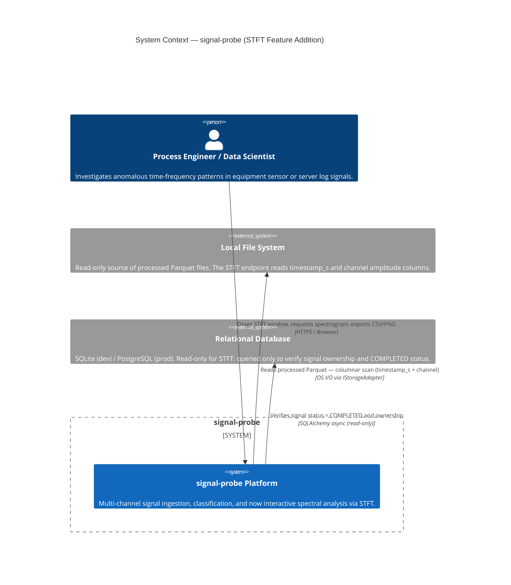
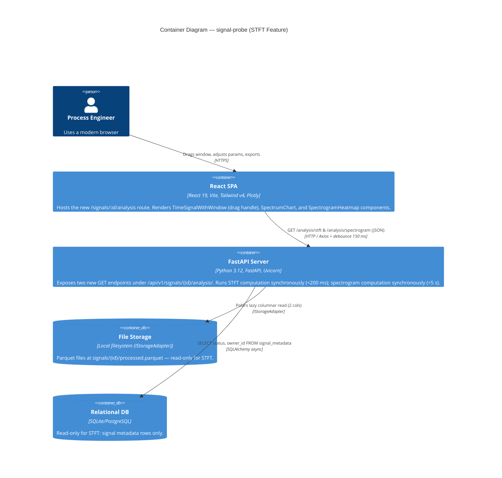
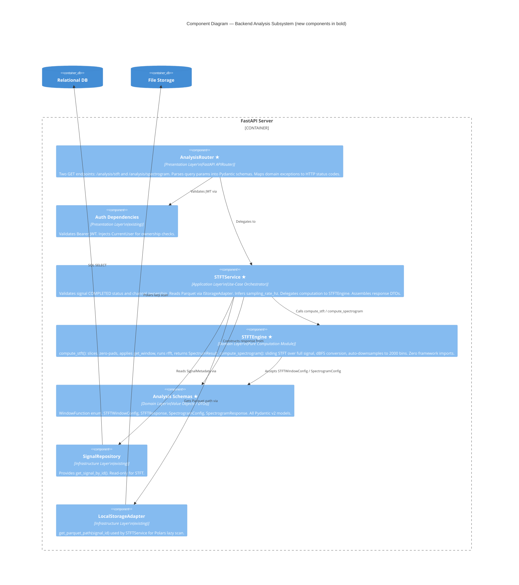
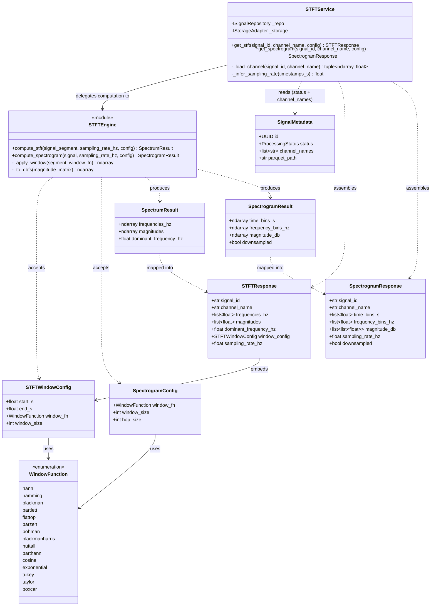
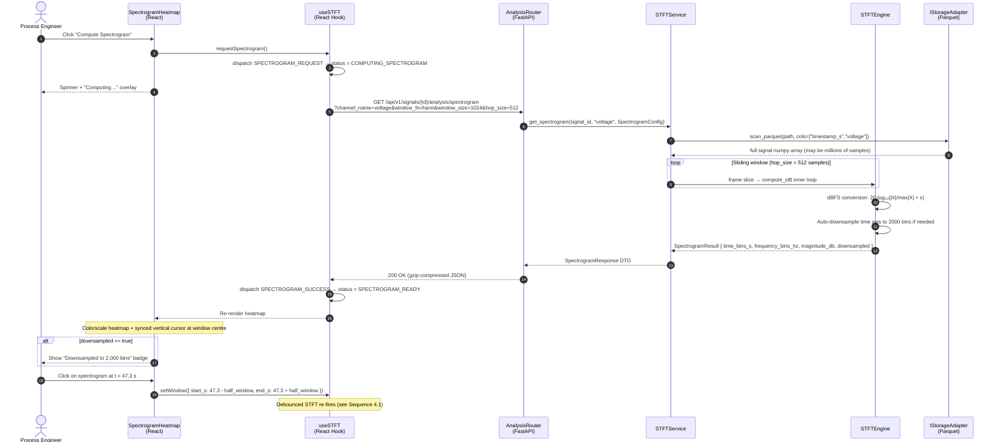

# Architecture Design Document

**Service:** signal-probe
**Feature:** STFT Interactive Spectral Analysis
**Architect:** GitHub Copilot (Architecture-Design Skill)
**Version:** 1.0
**Date:** 2026-04-23
**Status:** Draft — For Review

> **Related Documents**
> - Business Requirements: `SRS_STFT.md`
> - Technical Specification: `SDD_STFT.md`
> - Existing System Architecture: `ARCHITECTURE.md`
> - Architecture Decision Records: See §8 of this document.

---

## Table of Contents

1. [Service Identity](#1-service-identity)
2. [C4 Diagrams](#2-c4-diagrams)
   - [2.1 Context Diagram](#21-context-diagram)
   - [2.2 Container Diagram](#22-container-diagram)
   - [2.3 Component Diagram — Backend Analysis Subsystem](#23-component-diagram--backend-analysis-subsystem)
   - [2.4 Component Diagram — Frontend Analysis Subsystem](#24-component-diagram--frontend-analysis-subsystem)
3. [Domain Model: UML Class Diagram](#3-domain-model-uml-class-diagram)
4. [Interaction Design: UML Sequence Diagrams](#4-interaction-design-uml-sequence-diagrams)
   - [4.1 Interactive Window Drag → STFT Update Flow](#41-interactive-window-drag--stft-update-flow)
   - [4.2 User-Initiated Spectrogram Computation Flow](#42-user-initiated-spectrogram-computation-flow)
5. [REST API Contracts](#5-rest-api-contracts)
6. [LLD: Clean Architecture Compliance](#6-lld-clean-architecture-compliance)
7. [SOLID Principles Analysis](#7-solid-principles-analysis)
8. [Architecture Decision Records (ADRs)](#8-architecture-decision-records-adrs)
9. [Assumptions & External Dependencies](#9-assumptions--external-dependencies)

---

## 1. Service Identity

| Property | Value |
|---|---|
| **Service Name** | signal-probe — Spectral Analysis Module |
| **Owner Team** | Platform / Signal Analysis |
| **API Version** | `v1` |
| **Base URL** | `http://localhost:8000/api/v1/signals/{id}/analysis` (dev) |
| **Auth Mechanism** | Bearer JWT — reuses existing `get_current_user` FastAPI dependency |
| **Primary Data Source** | Processed Parquet (read-only); no new SQL tables required |
| **Frontend Route** | `/signals/:id/analysis` (new React Router v7 route) |
| **Integration Boundary** | Only `COMPLETED` signals are eligible; disabled tab for all other statuses |

---

## 2. C4 Diagrams

### 2.1 Context Diagram

The STFT module sits entirely inside the existing signal-probe boundary. External actor and infrastructure actors remain unchanged; the only new relationship is the browser receiving spectrogram/spectrum data through the existing API server.



---

### 2.2 Container Diagram

The STFT feature introduces no new containers. All computation happens inside the existing FastAPI server; all visualisation happens inside the existing React SPA.



---

### 2.3 Component Diagram — Backend Analysis Subsystem

This diagram shows the new components added to the FastAPI server and how they integrate with the existing signal infrastructure, strictly following Clean Architecture layer rules.



> ★ = New component introduced by STFT feature.

---

### 2.4 Component Diagram — Frontend Analysis Subsystem

```mermaid
C4Component
    title Component Diagram — Frontend Analysis Subsystem (new components in bold)

    Container_Boundary(spa, "React SPA") {

        Component(analysisPage, "AnalysisPage ★", "Page Component\n(React Router v7 route)", "Route: /signals/:id/analysis. Reads signalId from URL params. Fetches MacroViewResponse for channel names (reuses existing endpoint). Owns useSTFT hook instance.")

        Component(stftPanel, "STFTPanel ★", "Layout Component", "Orchestrates the 4 sub-panels. Receives all state and callbacks from AnalysisPage via prop-drilling (shallow tree — no context needed).")

        Component(channelSelector, "ChannelSelector", "Presentation Component\n(existing pattern)", "Dropdown to pick the active channel. Triggers SELECT_CHANNEL action.")

        Component(windowConfig, "WindowConfigControls ★", "Presentation Component", "window_fn <select>, window_size <input range> (powers of 2). Displays computed freq_resolution_hz and window_duration_s. Triggers SET_WINDOW action.")

        Component(timeSignal, "TimeSignalWithWindow ★", "Plotly scattergl Component", "Renders full channel signal. Injects editable Plotly rectangle shape. onRelayout fires SET_WINDOW with new start_s / end_s on drag end.")

        Component(spectrumChart, "SpectrumChart ★", "Plotly bar Component", "Bar chart of frequencies_hz × magnitudes. Vertical dashed line at dominant_frequency_hz. Log-scale toggle. Export CSV button.")

        Component(spectrogramHeatmap, "SpectrogramHeatmap ★", "Plotly heatmap Component", "Lazy: hidden until user clicks 'Compute Spectrogram'. Renders magnitude_db heatmap. Synced vertical cursor at window centre. Click → re-centre window. Export PNG button.")

        Component(useSTFT, "useSTFT ★", "Custom Hook\n(useReducer + Axios)", "State machine: IDLE→READY→COMPUTING_STFT→SPECTRUM_READY. Debounces SET_WINDOW by 150 ms. Manages stftError / spectrogramError separately.")
    }

    Container(api, "FastAPI Server", "", "")

    Rel(analysisPage, stftPanel, "Passes state + callbacks")
    Rel(analysisPage, useSTFT, "Owns hook")
    Rel(stftPanel, channelSelector, "Renders")
    Rel(stftPanel, windowConfig, "Renders")
    Rel(stftPanel, timeSignal, "Renders")
    Rel(stftPanel, spectrumChart, "Renders")
    Rel(stftPanel, spectrogramHeatmap, "Renders")
    Rel(useSTFT, api, "GET /analysis/stft (debounced 150 ms)", "Axios")
    Rel(useSTFT, api, "GET /analysis/spectrogram (on demand)", "Axios")
    Rel(timeSignal, useSTFT, "onRelayout → setWindow()")
    Rel(windowConfig, useSTFT, "onChange → setWindow()")
    Rel(channelSelector, useSTFT, "onChange → selectChannel()")
    Rel(spectrogramHeatmap, useSTFT, "onClick → setWindow() / requestSpectrogram()")
```



> ★ = New component introduced by STFT feature.

---

## 3. Domain Model: UML Class Diagram

This diagram covers the **Spectral Analysis** bounded context. Existing signal-probe entities are shown in grey for reference; new entities are the primary focus.



---

## 4. Interaction Design: UML Sequence Diagrams

### 4.1 Interactive Window Drag → STFT Update Flow

This is the core real-time interaction. The 150 ms debounce is applied in the `useSTFT` hook before any HTTP request is made, protecting the server from continuous drag events.

```mermaid
sequenceDiagram
    autonumber
    actor User as Process Engineer
    participant Plot as TimeSignalWithWindow<br/>(Plotly)
    participant Hook as useSTFT<br/>(React Hook)
    participant API as AnalysisRouter<br/>(FastAPI)
    participant Svc as STFTService
    participant Engine as STFTEngine
    participant FS as IStorageAdapter<br/>(Parquet)

    User->>Plot: Drag rectangle handle (continuous events)
    Note over Plot,Hook: Plotly fires relayoutData on every pixel move
    Plot->>Hook: onRelayout({ "shapes[0].x0": 42.1, "shapes[0].x1": 43.1 })
    Hook->>Hook: dispatch SET_WINDOW; start 150 ms debounce timer

    Note over Hook: Timer resets on each new drag event (debounce)

    Hook->>Hook: 150 ms elapsed → dispatch STFT_REQUEST
    Hook->>API: GET /api/v1/signals/{id}/analysis/stft<br/>?channel_name=voltage&start_s=42.1&end_s=43.1&window_fn=hann&window_size=1024
    API->>API: Validate JWT + signal ownership
    API->>Svc: get_stft(signal_id, "voltage", STFTWindowConfig)
    Svc->>FS: scan_parquet(path, cols=["timestamp_s","voltage"])
    FS-->>Svc: numpy arrays (timestamps, amplitudes)
    Svc->>Svc: Slice [42.1, 43.1]; infer sampling_rate_hz
    Svc->>Engine: compute_stft(segment, sr, config)
    Engine->>Engine: get_window("hann", 1024)
    Engine->>Engine: rfft(windowed_segment)
    Engine->>Engine: rfftfreq → dominant_frequency_hz
    Engine-->>Svc: SpectrumResult
    Svc-->>API: STFTResponse DTO
    API-->>Hook: 200 OK { frequencies_hz, magnitudes, dominant_frequency_hz, … }
    Hook->>Hook: dispatch STFT_SUCCESS → status = SPECTRUM_READY
    Hook-->>Plot: Re-render SpectrumChart (new magnitudes)
    Note over Plot: Dominant frequency dashed line updates
```

---

### 4.2 User-Initiated Spectrogram Computation Flow

The spectrogram is explicitly opt-in (ADR-STFT-002). It computes over the **full signal**, not just the current window.



---

## 5. REST API Contracts

### 5.1 STFT Slice Endpoint

#### `GET /api/v1/signals/{signal_id}/analysis/stft`

- **Purpose:** Compute the one-sided FFT magnitude spectrum for a user-defined time window within a single channel of a processed signal.
- **Authentication:** Bearer JWT (required)
- **Path Parameter:** `signal_id` (UUID, required)
- **Query Parameters:**

  | Parameter | Type | Required | Default | Constraints |
  |-----------|------|----------|---------|-------------|
  | `channel_name` | string | ✓ | — | Must exist in `signal_metadata.channel_names` |
  | `start_s` | float | ✓ | — | `0 ≤ start_s < end_s` |
  | `end_s` | float | ✓ | — | `end_s ≤ max(timestamp_s)` (clamped if over) |
  | `window_fn` | `WindowFunction` | — | `hann` | Any value from `WindowFunction` enum |
  | `window_size` | integer | — | `1024` | Power of 2, range `[4, 131072]` |

- **Success Response `200 OK`:**
  ```json
  {
    "signal_id": "3fa85f64-5717-4562-b3fc-2c963f66afa6",
    "channel_name": "voltage",
    "frequencies_hz": [0.0, 1.953, 3.906, "..."],
    "magnitudes": [0.042, 1.891, 0.007, "..."],
    "dominant_frequency_hz": 50.0,
    "window_config": {
      "start_s": 42.1,
      "end_s": 43.1,
      "window_fn": "hann",
      "window_size": 1024
    },
    "sampling_rate_hz": 2000.0
  }
  ```

- **Error Responses:**

  | Status | Error Code | Description |
  |--------|-----------|-------------|
  | `401` | `UNAUTHORIZED` | Missing or invalid JWT. |
  | `403` | `FORBIDDEN` | Signal belongs to another user. |
  | `404` | `SIGNAL_NOT_FOUND` | `signal_id` does not exist. |
  | `404` | `CHANNEL_NOT_FOUND` | `channel_name` not in `channel_names`. |
  | `409` | `SIGNAL_NOT_COMPLETED` | Signal status ≠ `COMPLETED`. |
  | `422` | `VALIDATION_ERROR` | `start_s ≥ end_s`, `window_size` not power of 2, etc. |
  | `500` | `INTERNAL_ERROR` | Unexpected server-side error. |

---

### 5.2 Spectrogram Endpoint

#### `GET /api/v1/signals/{signal_id}/analysis/spectrogram`

- **Purpose:** Compute the full-signal sliding-window STFT spectrogram (time × frequency magnitude matrix in dBFS) for a single channel.
- **Authentication:** Bearer JWT (required)
- **Path Parameter:** `signal_id` (UUID, required)
- **Query Parameters:**

  | Parameter | Type | Required | Default | Constraints |
  |-----------|------|----------|---------|-------------|
  | `channel_name` | string | ✓ | — | Must exist in `channel_names` |
  | `window_fn` | `WindowFunction` | — | `hann` | Any `WindowFunction` enum value |
  | `window_size` | integer | — | `1024` | Power of 2, range `[4, 131072]` |
  | `hop_size` | integer | — | `512` | `1 ≤ hop_size ≤ window_size` |

- **Success Response `200 OK`:**
  ```json
  {
    "signal_id": "3fa85f64-5717-4562-b3fc-2c963f66afa6",
    "channel_name": "voltage",
    "time_bins_s": [0.256, 0.512, 0.768, "..."],
    "frequency_bins_hz": [0.0, 1.953, 3.906, "..."],
    "magnitude_db": [
      [-3.1, -12.4, -60.0, "..."],
      [-4.2, -10.1, -55.3, "..."]
    ],
    "sampling_rate_hz": 2000.0,
    "downsampled": false
  }
  ```

- **Error Responses:**

  | Status | Error Code | Description |
  |--------|-----------|-------------|
  | `401` | `UNAUTHORIZED` | Missing or invalid JWT. |
  | `403` | `FORBIDDEN` | Signal belongs to another user. |
  | `404` | `SIGNAL_NOT_FOUND` | `signal_id` does not exist. |
  | `404` | `CHANNEL_NOT_FOUND` | `channel_name` not in `channel_names`. |
  | `409` | `SIGNAL_NOT_COMPLETED` | Signal status ≠ `COMPLETED`. |
  | `413` | `PAYLOAD_TOO_LARGE` | Response exceeds `STFT_MAX_RESPONSE_MB` (default 50 MB). |
  | `422` | `VALIDATION_ERROR` | `hop_size > window_size`, etc. |
  | `500` | `INTERNAL_ERROR` | Unexpected server-side error. |

> **Note:** Both endpoints use the existing global error envelope: `{"error": {"code": "…", "message": "…", "timestamp": "…"}}`.

---

## 6. LLD: Clean Architecture Compliance

The STFT feature strictly obeys the inward-only dependency rule from the Clean Architecture reference.

```
Layer               New Files                             Dependencies
──────────────────────────────────────────────────────────────────────
Presentation        endpoints/analysis.py                 → Application
Application         application/analysis/stft_service.py → Domain, Infrastructure interfaces
Domain              domain/analysis/stft_engine.py        → numpy, scipy ONLY (no framework)
Domain              domain/analysis/schemas.py            → pydantic ONLY
Infrastructure      (existing) LocalStorageAdapter        → filesystem
Infrastructure      (existing) SignalRepository           → SQLAlchemy
```

**Critical invariant:** `stft_engine.py` has **zero** FastAPI, SQLAlchemy, or Polars imports. It accepts plain `numpy.ndarray` + `STFTWindowConfig`/`SpectrogramConfig` value objects and returns `SpectrumResult`/`SpectrogramResult` dataclasses. This ensures the entire computation module can be unit-tested without spinning up any I/O subsystem.

**Dependency Injection:** `STFTService.__init__` receives `ISignalRepository` and `IStorageAdapter` interfaces via FastAPI `Depends()`, never constructing them internally (DIP compliance).

---

## 7. SOLID Principles Analysis

### S — Single Responsibility Principle

| Component | Responsibility |
|-----------|---------------|
| `AnalysisRouter` | HTTP contract translation only — no business logic |
| `STFTService` | Orchestration: status validation + Parquet read + delegation |
| `STFTEngine` | Pure FFT mathematics — no I/O, no validation |
| `useSTFT` hook | React state machine + API calls — no Plotly rendering |
| Each Plotly component | Visual rendering only — no data fetching |

### O — Open/Closed Principle

`WindowFunction` is an `str` enum. Adding a new window function (e.g., `kaiser`) requires only adding a new enum member — `STFTEngine` passes the value directly to `scipy.signal.get_window`, so zero changes to engine logic are needed.

### L — Liskov Substitution Principle

`STFTService` depends on `IStorageAdapter`. The existing `LocalStorageAdapter` can be replaced by an `S3StorageAdapter` (future) without any changes to `STFTService` or `STFTEngine`.

### I — Interface Segregation Principle

`STFTService` only calls `IStorageAdapter.get_parquet_path(signal_id: UUID) → Path`. It does not depend on `save_raw_file`, `delete_signal`, or any other storage methods it does not use.

### D — Dependency Inversion Principle

```python
# CORRECT — as implemented:
class STFTService:
    def __init__(
        self,
        repo: ISignalRepository,      # ← abstraction injected
        storage: IStorageAdapter,     # ← abstraction injected
    ) -> None:
        self._repo = repo
        self._storage = storage

# Never inside STFTService:
#   self._storage = LocalStorageAdapter()   ← violation
```

---

## 8. Architecture Decision Records (ADRs)

### ADR-STFT-001 — FFT Library: NumPy `rfft` over SciPy `fft`

| | |
|---|---|
| **Status** | Accepted |
| **Decision** | Use `numpy.fft.rfft` as the primary FFT. Use `scipy.signal.get_window` for window generation only. |
| **Context** | Both NumPy and SciPy provide FFT. For real-valued input, `rfft` halves the output to N/2+1 bins, saving memory and compute. SciPy's `fftpack.rfft` uses a different output convention; NumPy's is simpler and directly compatible with `rfftfreq`. |
| **Consequences** | Positive: smaller memory footprint, simpler code. Risk: NumPy's FFT is not the fastest available (FFTW via `pyfftw` is ~2× faster for large N). Acceptable for N ≤ 131072. |

---

### ADR-STFT-002 — Spectrogram is User-Initiated, Not Auto-Computed

| | |
|---|---|
| **Status** | Accepted |
| **Decision** | The spectrogram heatmap is rendered only when the user clicks "Compute Spectrogram". The STFT slice auto-updates on every window drag. |
| **Context** | Full-signal spectrogram computation is O(N/hop × window_size × log(window_size)). For a 10 M-sample signal with hop=512, this is ~19,500 FFT operations, taking up to 5 s. Auto-triggering on channel load would stall the UI on every navigation. |
| **Consequences** | UX: user must explicitly request the heatmap. Mitigation: the STFT slice (< 200 ms) gives immediate spectral feedback; the spectrogram is a supplementary "deep-dive" view. |

---

### ADR-STFT-003 — Debounce Window Drag at 150 ms

| | |
|---|---|
| **Status** | Accepted |
| **Decision** | `useSTFT` debounces `SET_WINDOW` actions by 150 ms before issuing HTTP requests. |
| **Context** | Plotly fires `relayoutData` continuously at ~60 fps during drag gestures. Without debouncing, a 1-second drag would issue ~60 API requests simultaneously, causing request queuing and out-of-order responses. |
| **Consequences** | Positive: server load reduced from ~60 req/s to ~7 req/s during active dragging. Trade-off: spectrum update lags 150 ms behind cursor position — imperceptible in practice. |

---

### ADR-STFT-004 — Auto-Downsample Spectrogram to 2000 Time Bins

| | |
|---|---|
| **Status** | Accepted |
| **Decision** | When the full spectrogram would produce > 2000 time bins, the engine uniformly downsamples to 2000 bins. A `downsampled: true` flag is returned in the response. |
| **Context** | A 10 M-sample signal with hop_size=512 produces ~19,500 time bins. Transmitting a 19,500 × 513 float64 matrix would be ~80 MB. The Plotly heatmap renders ≤ 2000 columns without any visible quality loss at standard screen resolutions (1920 px). |
| **Consequences** | Positive: response payload reduced from ~80 MB to ~8 MB for large signals. Risk: fine-grained time events < hop_size × 2000/N may be missed. Acceptable for v1.0; future releases may support server-side zoom. |

---

### ADR-STFT-005 — Phase Spectrum Deferred to v2.0

| | |
|---|---|
| **Status** | Accepted |
| **Decision** | `STFTResponse` returns `magnitudes` only. `phases_rad` is not included in v1.0. |
| **Context** | Phase spectrum doubles the JSON payload and is rarely actionable for industrial anomaly analysis (amplitude/energy is the primary diagnostic tool). |
| **Consequences** | Phase can be enabled via a future `include_phase=true` query parameter without breaking existing callers (additive change). |

---

### ADR-STFT-006 — No New Database Tables

| | |
|---|---|
| **Status** | Accepted |
| **Decision** | The STFT feature introduces zero new SQL tables. Signal status and channel names are read from the existing `signal_metadata` table. |
| **Context** | The HLD guide requires asking before introducing new database technology. STFT computation results are ephemeral (re-computed on demand in < 5 s) and do not benefit from persistence. Caching (if needed) can be added at the HTTP layer (ETag / Last-Modified). |
| **Consequences** | Positive: zero migration scripts, zero schema drift risk. Trade-off: spectrogram is re-computed on every request; for very large signals this may be slow. Mitigation: `STFT_MAX_RESPONSE_MB` env var prevents runaway payloads; background task migration is documented as a post-v1.0 enhancement. |

---

## 9. Assumptions & External Dependencies

| # | Type | Description | Risk | Fallback / Mitigation |
|---|------|-------------|------|----------------------|
| 1 | Assumption | The processed Parquet file for any `COMPLETED` signal always contains a `timestamp_s` column with monotonically non-decreasing values. | — | STFTService will raise `ValidationError` if `np.diff(timestamps).min() ≤ 0`. |
| 2 | Assumption | Sampling rate is uniform (constant Δt). STFT theory requires uniform sampling for Hz interpretation of FFT bins to be correct. | Medium | Median-based sampling rate inference provides a best-effort estimate for near-uniform signals. Non-uniform resampling is documented as out of scope for v1.0. |
| 3 | Assumption | The `signal_metadata.channel_names` list is authoritative and matches the Parquet column names at query time. | Low | If a Parquet column is missing (file corruption), `STFTService` raises `NotFoundException` with a descriptive message. |
| 4 | Ext. Dependency | **NumPy ≥ 1.26** — provides `rfft`, `rfftfreq`, and `ndarray` operations. | Low | Core scientific Python library; extremely stable API. Pinned in `pyproject.toml`. |
| 5 | Ext. Dependency | **SciPy ≥ 1.12** — provides `scipy.signal.get_window`. | Low | Stable, well-maintained. If removed, window functions can be implemented manually (Hann, Hamming, Blackman are simple formulas). |
| 6 | Ext. Dependency | **Polars ≥ 0.20** — lazy Parquet scan for single-column reads. | Low | Already a project dependency. Columnar read ensures O(1 column) I/O regardless of how many channels exist in the Parquet file. |
| 7 | Ext. Dependency | **Plotly.js (via React)** — `scattergl`, `bar`, `heatmap` traces + editable shapes. | Low | Already bundled in the SPA. Editable shapes require `config.editable: true`; this is a Plotly-supported, documented feature. |
| 8 | Operational | `STFT_MAX_RESPONSE_MB` environment variable (default 50). Controls the hard ceiling on spectrogram payload size. | Medium | If unset, defaults to 50 MB. Operators should tune based on available RAM and network bandwidth. Value of 0 disables the limit (not recommended). |
