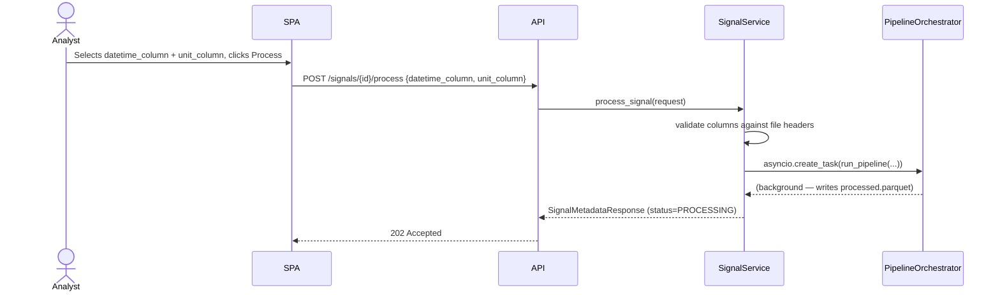

# Tutorial: Efficient Project Development with GitHub Copilot Skills + SDD Pattern

> **Audience:** Engineers, architects, and product managers contributing to signal-probe or any project that follows this skill-driven development methodology.
>
> **Purpose:** Walk through the complete development process — from raw business idea to shipped, tested code — using GitHub Copilot Skills as role-specific agents and the SDD as the central handoff contract.

---

## Table of Contents

1. [Why This Methodology?](#1-why-this-methodology)
2. [The Six-Phase Pipeline Overview](#2-the-six-phase-pipeline-overview)
3. [Phase 1 — Requirements Analysis](#3-phase-1--requirements-analysis)
4. [Phase 2 — Architecture Design](#4-phase-2--architecture-design)
5. [Phase 3 — SDD: The Bridge Document](#5-phase-3--sdd-the-bridge-document)
6. [Phase 4 — Backend Engineering](#6-phase-4--backend-engineering)
7. [Phase 5 — Frontend Development](#7-phase-5--frontend-development)
8. [Phase 6 — Testing & DevOps](#8-phase-6--testing--devops)
9. [RACI: Who Does What](#9-raci-who-does-what)
10. [The Golden Rules of Skill Handoffs](#10-the-golden-rules-of-skill-handoffs)
11. [Anti-Patterns to Avoid](#11-anti-patterns-to-avoid)
12. [Worked Example: signal-probe Feature End-to-End](#12-worked-example-signal-probe-feature-end-to-end)
13. [Summary: One-Page Cheat Sheet](#13-summary-one-page-cheat-sheet)

---

## 1. Why This Methodology?

Most development waste happens in the **gap between intent and implementation**: a stakeholder has a business need, engineers interpret it differently, and the resulting code solves a different problem. Each "skill" in this system is a **specialist role** with a defined knowledge base, clear inputs, and clear outputs. The **SDD (Software Design Document)** is the handoff contract that links them.

```
Without this pattern:            With this pattern:
─────────────────────────        ───────────────────────────────────────────
Vague idea                       Structured SRS   (requirements-analysis)
   ↓                                ↓
"Just code it"                   Reviewed Architecture  (architecture-design)
   ↓                                ↓
Rework after demo                SDD with pseudocode specs
   ↓                                ↓
More rework                      Backend code     (backend-engineering)
                                    ↓
                                 Frontend code    (frontend-development)
                                    ↓
                                 Tests + CI/CD    (automation-testing, devops-cicd)
```

**Key principle:** Each skill is **Accountable and Responsible** for its own phase but must **Consult** the previous phase's output before producing anything. No phase invents requirements — it only refines them.

---

## 2. The Six-Phase Pipeline Overview

```
┌────────────────────────────────────────────────────────────────────────────┐
│  PHASE 1         PHASE 2          PHASE 3          PHASE 4     PHASE 5     │
│                                                                             │
│  requirements →  architecture  →  SDD          →  backend  →  frontend    │
│  -analysis       -design          (bridge)         -engineering -development│
│  skill           skill            document         skill        skill       │
│                                                                             │
│  Output:         Output:          Output:          Output:      Output:     │
│  SRS.md          ARCHITECTURE.md  SDD.md           API code     UI code     │
│                                       ↑                                     │
│                            Central handoff contract                         │
└────────────────────────────────────────────────────────────────────────────┘
                                        ↓  (throughout all phases)
                             automation-testing + devops-cicd skills
```

**Rule:** The SDD is the **single source of truth** between architecture and engineering. Engineers are not allowed to interpret architecture diagrams directly — they read the SDD.

---

## 3. Phase 1 — Requirements Analysis

**Skill:** `requirements-analysis`
**Input:** A business idea, user complaint, or product backlog item
**Output:** `SRS.md` — a structured, testable specification
**Role persona:** Product Manager / Business Analyst

### 3.1 How to invoke

```
User: "Analysts uploading CSVs from third-party equipment can't choose
       which datetime column drives the chart x-axis."

→ invoke: requirements-analysis skill
→ task:   translate this into a structured SRS
```

### 3.2 What the skill produces

The skill applies the **Agile Elicitation Framework** and **DDD Business Logic Models** to produce:

| Section | What to write | Signal-probe example |
|---|---|---|
| **Product Overview** | Business goal, target audience, value proposition | "Eliminates reliance on hardcoded column-name aliases" |
| **Epics** | Large business initiative grouping multiple stories | `EPIC-1: Enhanced Column Configuration at Upload Time` |
| **User Stories** | `As a [user], I want [action] so that [value]` | `US-1.1: Datetime Column Selection for Stacked Format` |
| **BDD Scenarios** | Given-When-Then for every happy path + edge case | 5 scenarios for US-1.1, 7 for US-1.2 |
| **Business Rules** | Non-negotiable constraints | "Only `temporal`-dtype columns may be the datetime column" |
| **NFRs** | Performance, security, compatibility | "≤50ms pipeline overhead per 100k rows" |
| **Out-of-Scope** | What is explicitly excluded | "Time-unit multiplier; post-processing unit editing" |
| **Glossary** | Definitions for domain terms | `t0_epoch_s`, `channel_units`, `AWAITING_CONFIG` |

### 3.3 BDD Scenario Template

Every user story must have at least one **happy path** and at least one **unhappy path**:

```gherkin
# Happy path
Scenario 1 — Explicit selection overrides alias detection
  Given  a stacked-format CSV with column "event_time" (temporal dtype)
  When   the user selects "event_time" as the datetime column and clicks Process
  Then   the pipeline computes elapsed seconds from "event_time"
  And    t0_epoch_s is set to the Unix epoch of the first event_time value

# Unhappy path (edge case)
Scenario 4 — No temporal column detected
  Given  a stacked-format CSV with no temporal-dtype column
  When   the column config panel renders
  Then   an inline warning is displayed
  And    the Process Signal button remains disabled
```

### 3.4 Phase 1 Checklist

- [ ] Every user story has a measurable acceptance criterion
- [ ] Every happy path has at least one corresponding unhappy path
- [ ] All domain terms are defined in the Glossary
- [ ] Out-of-scope items are explicitly listed
- [ ] NFRs have numeric targets (not "fast" — "≤50ms")
- [ ] API backward-compatibility rules are stated

---

## 4. Phase 2 — Architecture Design

**Skill:** `architecture-design`
**Input:** `SRS.md` from Phase 1
**Output:** `ARCHITECTURE.md` — C4 diagrams, UML, API contracts, ADRs
**Role persona:** System / Software Architect

### 4.1 How to invoke

```
User: "We have SRS.md. Design the system architecture for this feature."

→ invoke: architecture-design skill
→ input:  SRS.md
→ output: ARCHITECTURE.md with C4 + UML + ADRs
```

### 4.2 The C4 Model

Produce **three levels** of diagram in order. Never skip straight to component level:

```
Level 1: Context Diagram
  "What external actors and systems interact with signal-probe?"
  Analyst → signal-probe ↔ File System, Relational DB

Level 2: Container Diagram
  "What runtime processes make up the system?"
  React SPA → FastAPI Server → PostgreSQL + Parquet Storage

Level 3: Component Diagram
  "What are the internal modules of the FastAPI server?"
  Router → SignalService → [ColumnInspector | PipelineOrchestrator]
         → [SignalRepository | LocalStorageAdapter]
```

### 4.3 Clean Architecture Layer Rules

The architect defines which layer each new component belongs to — engineers cannot move components across layers without an ADR:

```
Presentation Layer   HTTP handlers only — no business logic
Application Layer    Use-case orchestrators, pipeline tasks, query services
Domain Layer         Entities, Value Objects, enums, pure algorithms
Infrastructure Layer DB repositories, storage adapters, external HTTP clients
```

**Dependency rule (absolute):** arrows point **inward only**. `SignalService` (Application) may call `IStorageAdapter` (Infrastructure abstraction in Domain), but `SignalRepository` (Infrastructure) must never import from `SignalService`.

### 4.4 Sequence Diagrams

For every user story, produce a sequence diagram tracing the full request path. This becomes the **contract** that both backend and frontend engineers follow:



### 4.5 Architecture Decision Records (ADRs)

For every non-obvious choice, write an ADR. Format:

```markdown
## ADR-001: Store channel_units in Parquet, not SQL

**Status:** Accepted
**Context:** channel_units is derived from raw file content at pipeline time.
**Decision:** Write __unit_<channel> as constant columns in the processed Parquet.
**Rationale:** Avoids a schema migration; co-located with the data it describes;
  readable by get_macro_view with a single DataFrame scan.
**Consequences:** channel_units is not queryable via SQL. Acceptable because
  callers retrieve it via GET /macro, not via direct DB query.
```

### 4.6 Phase 2 Checklist

- [ ] C4 diagrams produced at all three levels
- [ ] Every new component is assigned to a Clean Architecture layer
- [ ] Sequence diagram produced for every user story
- [ ] UML class diagram shows all new/changed value objects
- [ ] API contracts defined (path, method, request body, response body, error codes)
- [ ] At least one ADR per non-obvious architectural decision
- [ ] SOLID principles analysis completed for new modules

---

## 5. Phase 3 — SDD: The Bridge Document

**Who writes it:** Architect, in consultation with lead engineers
**Input:** `SRS.md` + `ARCHITECTURE.md`
**Output:** `SDD.md` — file-level pseudocode specs
**Purpose:** Translate diagrams into precise implementation instructions

### 5.1 Why SDD exists

The `ARCHITECTURE.md` tells you *what* to build and *how it fits together*. The `SDD.md` tells engineers *exactly which files to change and how*. Without it, every engineer interprets the architecture differently.

```
ARCHITECTURE.md says:         SDD.md says:
──────────────────────        ──────────────────────────────────────────────
"ProcessSignalRequest         "Add these fields to ProcessSignalRequest in
 gains two new fields"    →    backend/app/domain/signal/schemas.py:
                               datetime_column: str | None = Field(None, ...)
                               unit_column: str | None = Field(None, ...)"
```

### 5.2 SDD Structure

Every SDD must have these sections:

| Section | Content |
|---|---|
| **1. Introduction & Scope** | Purpose, in-scope items, out-of-scope items, stakeholders |
| **2. System Architecture (HLD)** | ASCII/Mermaid diagram linking UI → API → Pipeline → Storage |
| **3. DDD Mapping** | Bounded contexts, new domain events, new value objects |
| **4. Component Design (LLD)** | Per-file pseudocode for every change |
| **5. Data Design** | Parquet schema, DB schema changes |
| **6. API Contracts** | Full request/response JSON examples |
| **7. UI & Interaction Design** | User journey map, state machine |
| **8. Technical Specifications & NFRs** | Numeric targets, error codes, a11y requirements |

### 5.3 How to write a Component Design (LLD) section

For each file that changes, write a sub-section with:

1. **File path** (absolute within the repo)
2. **What changes** (additions, signature changes, behavior changes)
3. **Pseudocode** — precise enough that any engineer can implement it without ambiguity

```markdown
### 4.4.1 `_read_stacked_signal_file` — signature change

**File:** `backend/app/application/signal/pipeline.py`

**Signature change:**
```python
def _read_stacked_signal_file(
    df: pl.DataFrame,
    channel_filter: list[str] | None = None,
    datetime_col: str | None = None,   # NEW
) -> tuple[list[float], dict[str, list[float | None]], float]:
```

**Behavior change:**
- When `datetime_col` is provided: skip alias normalisation; use it directly.
- When `None`: fall back to existing `_normalize_stacked_columns()` logic.
- Raises `ValueError` if `datetime_col` not in `df.columns`.
```

### 5.4 SDD as the Test-Writing Contract

The BDD scenarios from `SRS.md` map directly to test cases. Before writing code, engineers should be able to read the SDD and write the tests:

```
SRS Scenario 1: "explicit selection overrides alias detection"
   ↓
SDD 4.4.1: "_read_stacked_signal_file(datetime_col='event_time')
            renames that column to 'datetime' before pivoting"
   ↓
Test: test_stacked_explicit_datetime_col_overrides_alias()
      df = pl.DataFrame({"event_time": [...], "signal_name": [...], ...})
      timestamps, channels, t0 = _read_stacked_signal_file(df, datetime_col="event_time")
      assert timestamps == expected_elapsed_seconds
```

---

## 6. Phase 4 — Backend Engineering

**Skill:** `backend-engineering`
**Input:** `SDD.md` §4.1–4.6 (backend LLD sections)
**Output:** Working Python/FastAPI code
**Rule:** Never implement anything not specified in the SDD. If the SDD is wrong, update SDD first.

### 6.1 Implementation Order

Always follow this strict bottom-up order to keep the domain stable before business logic is written:

```
1. Domain Layer       schemas.py, enums, value objects
        ↓
2. Application Layer  pipeline helpers, service methods
        ↓
3. Infrastructure     repository changes, storage adapter
        ↓
4. Presentation       endpoint adjustments (usually minimal if SDD is accurate)
```

### 6.2 Following API Design Standards

| Rule | Signal-probe application |
|---|---|
| Plural nouns | `/signals/{id}/process` — resource is `signals` |
| HTTP method semantics | `POST` to trigger processing (non-idempotent write) |
| Additive fields only | `datetime_column` + `unit_column` are `Optional` with `None` defaults |
| URL versioning | `/api/v1/` prefix; never removed |
| 422 for business violations | Column not found in file → HTTP 422, not 500 |
| OpenAPI docs | Pydantic `Field(description=...)` auto-populates `/docs` |

### 6.3 Clean Architecture Compliance Checklist

Before submitting any backend code for review:

- [ ] Does `domain/` contain any `import fastapi` or `import sqlalchemy`? **(Should be zero)**
- [ ] Does `application/` depend on `infrastructure/` **directly**? **(Should be via interface only)**
- [ ] Are new dependencies injected via constructor? **(Never instantiated inside business logic)**
- [ ] Is every error a `DomainError`, `InfrastructureError`, or `ValidationError`?
- [ ] Is the error caught and mapped to an HTTP status code at the **Presentation layer only**?
- [ ] Does every new pure function have a docstring explaining its contract?

### 6.4 Testing Backend Code (TDD-first)

Write the test **before** the implementation, using the SDD pseudocode as the spec:

```python
# Step 1: RED — write a failing test from the SDD spec
def test_extract_channel_units_stacked():
    df = pl.DataFrame({
        "signal_name": ["ch_a", "ch_a", "ch_b"],
        "unit":        ["mV",   "mV",   "°C"],
        "value":       [1.0,    2.0,    3.0],
    })
    result = _extract_channel_units(df, "unit", ["ch_a", "ch_b"], "stacked")
    assert result == {"ch_a": "mV", "ch_b": "°C"}

# Step 2: GREEN — implement the minimum code to pass
# Step 3: REFACTOR — clean up, ensure all edge cases pass
```

---

## 7. Phase 5 — Frontend Development

**Skill:** `frontend-development`
**Input:** `SDD.md` §4.7–4.10 (frontend LLD sections) + Architecture API contracts
**Output:** React TypeScript components and hooks
**Rule:** Consult the Architecture API Interface Definition before implementing any new API call.

### 7.1 Implementation Order

```
1. TypeScript types      types/signal.ts        (mirrors API contracts exactly)
        ↓
2. Custom hooks          useColumnConfig.ts     (state machine for the form)
        ↓
3. Presentational UI     UnitColumnSelector,    (atomic, reusable, no side-effects)
                         TimeColumnSelector
        ↓
4. Container components  ColumnConfigPanel      (composes the above)
        ↓
5. Visualization         MultiChannelMacroChart (consumes new API response fields)
```

### 7.2 State Classification

Before writing any state, classify it using this decision tree:

```
Is the state used only by ONE component?
  → YES: useState / useReducer

Is the state fetched from a server?
  → YES: TanStack Query  (NOT Zustand — never double-store server data)

Does the state need to be in the URL?
  → YES: useSearchParams

Is it complex form logic with validation?
  → YES: React Hook Form

Is the state shared across 3+ components with no server sync?
  → YES: Zustand (or React Context for infrequent updates like theme)
```

**Signal-probe application:**

| State | Classification | Tool |
|---|---|---|
| `datetimeCol` / `unitCol` | Complex form state, submitted to API | `useReducer` inside `useColumnConfig` |
| Macro view data | Server-fetched | TanStack Query `useQuery` |
| Chart theme | Global, infrequent | `ThemeContext` (React Context) |

### 7.3 Hook Design

A custom hook is the correct abstraction when:
- A UI component has **complex fetch + submit state** (loading, error, data)
- **Multiple related state variables** change together as a unit
- The logic needs to be **testable independently** from the render tree

```typescript
// useColumnConfig.ts — owns ALL state for the column config form
interface ColumnConfigState {
  // … existing fields …
  datetimeCol: string | null;  // NEW — stacked datetime selector
  unitCol: string | null;      // NEW — unit column selector
}

type Action =
  | { type: 'SET_DATETIME_COL'; payload: string | null }
  | { type: 'SET_UNIT_COL';     payload: string | null }
  // … existing actions …

// The hook assembles the ProcessSignalRequest before submission
const buildRequest = (state: ColumnConfigState): ProcessSignalRequest => ({
  csv_format:      state.csvFormat,
  datetime_column: state.csvFormat === 'stacked' ? state.datetimeCol : undefined,
  unit_column:     state.unitCol ?? undefined,
  // … existing fields …
});
```

### 7.4 Component Design Rules

| Rule | Rationale |
|---|---|
| One component = one responsibility | `UnitColumnSelector` only renders the radio group — it knows nothing about submission |
| Props are typed with TypeScript interfaces | Catch contract mismatches at compile time, not at runtime |
| Error states are rendered inline | SRS requires inline errors (a11y + UX) |
| `role="radiogroup"` + `aria-labelledby` | SRS NFR: a11y patterns must match existing components |
| Reuse existing sub-components | `TimeColumnSelector` reused for stacked datetime — avoids divergence |

### 7.5 Frontend Checklist

- [ ] TypeScript types added to `types/signal.ts` **before** writing any component
- [ ] New state classified and justified (useState / useReducer / hook)
- [ ] No API response data stored in Zustand/context (use TanStack Query)
- [ ] All new radio groups have `role="radiogroup"` + `aria-labelledby`
- [ ] Inline validation errors match the error strings from SRS Business Rules
- [ ] `React.memo` used **only** where profiler shows a measurable benefit

---

## 8. Phase 6 — Testing & DevOps

**Skills:** `automation-testing`, `devops-cicd`
**Input:** `SRS.md` (BDD scenarios) + `SDD.md` (component specs) + implemented code
**Outputs:** Test suite, CI/CD pipeline config

### 8.1 Test Layer Mapping

Every BDD scenario in `SRS.md` must map to at least one automated test:

| SRS Level | Test Type | Tool |
|---|---|---|
| BDD Acceptance Criteria | E2E test | Playwright / Cypress (Page Object Model) |
| API Contract | Integration test | pytest + TestClient |
| Application logic | Unit test | pytest |
| Pure domain functions | Unit test | pytest |
| Frontend component | Component test | Vitest + Testing Library |

```
SRS Scenario 2 — "Single temporal column: auto-selected"
   ↓
Frontend unit test (useColumnConfig):
  it("pre-selects the only temporal column for stacked format", () => {
    const { result } = renderHook(() => useColumnConfig(...));
    expect(result.current.state.datetimeCol).toBe("datetime");
  });

Backend integration test:
  def test_process_signal_stacked_auto_datetime_column(client, stacked_signal):
      response = client.post(f"/signals/{stacked_signal.id}/process",
                             json={"csv_format": "stacked"})  # no datetime_column
      assert response.status_code == 202
```

### 8.2 CI/CD Pipeline Stages

```yaml
# Every PR must pass all stages before merge
stages:
  1. lint          → ruff check + ruff format  (backend)
                  → tsc --noEmit + eslint       (frontend)
  2. unit-tests    → pytest tests/ -v           (backend)
                  → vitest run                  (frontend)
  3. integration   → pytest --integration       (backend with testcontainers DB)
  4. build         → docker build               (verifies production build)
  5. e2e           → playwright test            (smoke tests against built image)
```

---

## 9. RACI: Who Does What

```
                         requirements  architecture  backend    frontend
                         -analysis     -design       -engineer  -developer
                         skill         skill         skill      skill
──────────────────────────────────────────────────────────────────────────
Write SRS                R/A           C             I          I
Write ARCHITECTURE.md    C             R/A           I          I
Write SDD                C             R/A           C          C
Implement backend code   I             C             R/A        I
Implement frontend code  I             C             I          R/A
Write unit tests         I             I             R/A        R/A
Write E2E tests          C             I             I          R/A
Review for compliance    I             A             R          R
──────────────────────────────────────────────────────────────────────────
R = Responsible  A = Accountable  C = Consulted  I = Informed
```

**Non-negotiable:** The `architecture-design` skill is **Consulted** (not bypassed) before any backend or frontend engineer adds a new module, service boundary, or state management pattern.

---

## 10. The Golden Rules of Skill Handoffs

### Rule 1 — No Phase Invents Requirements

Every design decision must trace back to a user story in the SRS. If a backend engineer wants to add a field not in the SDD, they must update the SDD and get it reviewed first.

### Rule 2 — The SDD is the Engineer's Single Source of Truth

Engineers read `SDD.md`, not `ARCHITECTURE.md`. The SDD translates diagrams into file-level instructions. If there is a conflict between `ARCHITECTURE.md` and `SDD.md`, the **SDD wins** — it is more recent and more specific.

### Rule 3 — Backward Compatibility is a Hard Constraint

New API fields are **always additive and optional**. This is enforced at every layer:

- **Schema:** `Optional` Pydantic fields with `None` defaults
- **Pipeline:** `if unit_column is not None:` guards around all new logic
- **Frontend:** `channel_units?: Record<string, string>` (optional TypeScript field)
- **Tests:** All existing tests must pass without modification

### Rule 4 — Pure Functions for New Algorithms

New data-transformation logic (e.g., `_extract_channel_units`) must be a **pure function** — no side effects, no I/O, deterministic output. This makes it independently testable and safely moveable between layers.

### Rule 5 — Errors are Classified in the Domain, Mapped at the Boundary

```
Domain raises:    ValueError("datetime_column not found")
                        ↓
Service catches:  raises KeyError  (re-classifies as "resource not found")
                        ↓
Endpoint maps:    except KeyError → HTTP 422 Unprocessable Entity
```

The HTTP status code is **never decided inside the domain or application layer**.

---

## 11. Anti-Patterns to Avoid

| Anti-Pattern | Symptom | Fix |
|---|---|---|
| **Skipping SRS** | Engineers implement features based on a Slack message | Always write at least a 1-page SRS with 3+ BDD scenarios before coding |
| **Architecture → Code (no SDD)** | Engineers interpret diagrams differently; divergent implementations | Architect writes file-level SDD pseudocode before engineers start |
| **Domain importing framework** | `from fastapi import HTTPException` inside `schemas.py` | Move the import to the Presentation layer; raise a domain error inside domain |
| **Server state in Zustand** | Stale API data; cache misses; double network calls | Use TanStack Query for all server-fetched data |
| **Breaking optional fields** | Adding a required field to an existing API response | All new response fields default to `None` or `{}` |
| **BDD for happy paths only** | Edge-case bugs discovered in production | Require at least 1 unhappy path per user story in SRS |
| **No ADRs written** | No one remembers why a design decision was made | Write an ADR for every decision that will confuse a future developer |

---

## 12. Worked Example: signal-probe Feature End-to-End

This is the exact flow used to deliver the **"User-Configurable X-Axis Datetime Column & Signal Unit Mapping"** feature.

### Step 1 — Invoke `requirements-analysis` skill

**Prompt given to the skill:**
```
Our stacked-format CSV pipeline hardcodes the datetime column via an alias
table. Analysts using vendor equipment with non-standard column names are
unable to process files. We also want an optional unit column to drive
y-axis labels. Translate this into an SRS.
```

**Output:** `SRS.md` with EPIC-1, US-1.1 (5 BDD scenarios), US-1.2 (7 BDD scenarios), NFRs, glossary.

---

### Step 2 — Invoke `architecture-design` skill

**Input:** `SRS.md`
**Prompt:** `"Design the architecture for SRS.md. Produce C4 diagrams, UML class diagram, sequence diagrams, and API contracts."`

**Output:** `ARCHITECTURE.md` with:
- C4 Context, Container, and Component diagrams (Mermaid)
- UML class diagram: `ProcessSignalRequest(+datetime_column, +unit_column)` and `MacroViewResponse(+channel_units)`
- 3 sequence diagrams: Upload+Inspect → Configure+Pipeline → MacroView retrieval
- Full API contract for `POST /signals/{id}/process` with new optional fields
- ADR-001: Store `channel_units` in Parquet, not in the SQL schema

---

### Step 3 — Write SDD.md

Working from `ARCHITECTURE.md`, the SDD specifies exactly **10 component changes**:

```
§4.1  schemas.py                 → 2 new Pydantic fields + 1 model_validator update
§4.2  format_constants.py        → no changes  (explicit column bypasses alias logic)
§4.3  column_inspector.py        → no changes  (already returns dtype correctly)
§4.4  pipeline.py                → 1 signature change + 1 new pure function + 1 signature change
§4.5  service.py                 → validation block + run_pipeline call site
§4.6  signals.py (endpoint)      → no changes  (Pydantic handles new fields transparently)
§4.7  types/signal.ts            → 2 new optional TypeScript fields
§4.8  useColumnConfig.ts         → 2 new state fields + 2 new dispatch actions
§4.9  ColumnConfigPanel.tsx      → 2 new UI sub-components
§4.10 MultiChannelMacroChart.tsx → y-axis title reads from channel_units map
```

---

### Step 4 — Invoke `backend-engineering` skill

**Input:** `SDD.md` §4.1–4.6

**Implementation order:**
```
1. schemas.py    (domain layer — ProcessSignalRequest + MacroViewResponse)
2. pipeline.py   (_read_stacked_signal_file + _extract_channel_units + run_pipeline)
3. service.py    (validation + run_pipeline call site)
4. signals.py    (no changes needed)
```

**Tests written first (TDD):**
```
test_extract_channel_units_stacked()
test_extract_channel_units_wide()
test_read_stacked_explicit_datetime_col()
test_run_pipeline_writes_unit_columns_to_parquet()
test_process_signal_validates_datetime_column_not_in_file()  → expects HTTP 422
```

---

### Step 5 — Invoke `frontend-development` skill

**Input:** `SDD.md` §4.7–4.10 + Architecture API contracts

**Implementation order:**
```
1. types/signal.ts      (datetime_column?, unit_column?, channel_units?)
2. useColumnConfig.ts   (datetimeCol + unitCol state; buildRequest assembles both)
3. TimeColumnSelector   (reused for stacked datetime axis — relabelled)
4. UnitColumnSelector   (new: radio group, string-dtype cols, "(none)" default)
5. ColumnConfigPanel    (adds both selectors; stacked gets inline unit preview)
6. MultiChannelMacroChart  (reads channel_units[ch] for y-axis title per channel)
```

---

### Step 6 — Tests pass; feature ships

```
.venv/bin/python -m pytest tests/ -v   →  All 47 tests pass (8 new)
npm run build                          →  No TypeScript errors
.venv/bin/ruff check                   →  0 violations
```

The entire feature was delivered with:
- **Zero rework** from misunderstood requirements (BDD scenarios locked scope)
- **Zero API breakage** for existing clients (all new fields optional with defaults)
- **Zero layer violations** (domain has no FastAPI imports; frontend uses correct state tools)

---

## 13. Summary: One-Page Cheat Sheet

```
PHASE       SKILL                   ARTEFACT          KEY RULE
────────────────────────────────────────────────────────────────────────────────
1  Reqs     requirements-analysis   SRS.md            BDD for every happy + unhappy path
2  Arch     architecture-design     ARCHITECTURE.md   C4 → UML → Sequence → ADRs
3  Design   (Architect writes)      SDD.md            File-level pseudocode; engineers read this
4  Backend  backend-engineering     Python code       Domain → Application → Infra → API
5  Frontend frontend-development    React/TS code     Types → Hook → Components → Charts
6  Testing  automation-testing      Test suite        1 BDD scenario = 1+ automated test
   Deploy   devops-cicd             CI/CD config      Lint → Unit → Integration → Build → E2E

GOLDEN RULES
  ① No phase invents requirements — trace everything to SRS
  ② SDD is the engineer's only contract — not the architecture diagrams
  ③ Backward compatibility is non-negotiable — all new fields are optional
  ④ New algorithms = pure functions — testable in isolation
  ⑤ Errors are classified in domain, mapped to HTTP codes in presentation only

ARTEFACT CHAIN
  Business idea
    → SRS.md          (BDD acceptance criteria, NFRs, glossary)
    → ARCHITECTURE.md (C4 diagrams, UML, sequence diagrams, ADRs)
    → SDD.md          (file-level pseudocode — the engineer's contract)
    → Code            (backend: Domain→App→Infra→API | frontend: Types→Hook→UI→Chart)
    → Tests           (pytest TDD + vitest + E2E Playwright)
    → CI/CD           (Lint→Unit→Integration→Build→E2E gating every PR)
```
